# AZ-900

- Tipos de Computação
- Hospedagem de aplicativos
- Redes Virtuais

## Computação e rede: 

 A computação do Azure é um serviço sob demanda que fornce recurso de computação, como discos, processadores, memórias, rede e sistemas opercionais
 


---

# Azure Functions - AZ-900

Azure Functions é um serviço de **Computação sem Servidor** (Serverless) no Microsoft Azure que permite a execução de pequenos blocos de código sem a necessidade de gerenciar infraestrutura. Ideal para tarefas automatizadas e processos que podem ser executados sob demanda ou com gatilhos específicos.

## 📌 Principais Características

- **Serverless**: Não há necessidade de gerenciar servidores ou dimensionar manualmente.
- **Baseado em Eventos**: Executa o código em resposta a eventos, como timers, mensagens em filas, eventos HTTP, entre outros.
- **Pagamento por Execução**: Você só paga pelo tempo em que a função é executada, reduzindo custos em aplicações esporádicas.

## 🛠️ Casos de Uso

- **Automação de Processos**: Envio de emails, notificações, processamento de dados em lotes.
- **API Serverless**: Implementação de APIs leves sem necessidade de backend dedicado.
- **ETL (Extract, Transform, Load)**: Transformação de dados em tempo real.
- **Respostas a Eventos**: Processamento de eventos de IoT, filas de mensagens, etc.

## 🚀 Benefícios no Azure

1. **Escalabilidade Automática**: Ajusta-se automaticamente à demanda, facilitando o crescimento sem configurar infraestruturas complexas.
2. **Custo-Efetivo**: O modelo de pagamento por consumo é ideal para processos esporádicos e ajuda a controlar custos.
3. **Integração com Outros Serviços do Azure**: Facilita a integração com Storage, Event Grid, Service Bus, entre outros.

## 🎯 Pontos para o Exame AZ-900

- **Definição de Serverless Computing**: Saiba explicar o que é computação sem servidor e a vantagem do modelo de pagamento sob demanda.
- **Cenários de Uso**: É importante entender quais situações são ideais para o uso do Azure Functions.
- **Integração**: Conhecer os serviços do Azure que podem ser integrados com as Azure Functions.

## Exemplo de Fluxo com Azure Functions


---

# Azure App Services - AZ-900

O **Azure App Services** é uma plataforma de **Platform as a Service (PaaS)** no Azure que facilita a criação, hospedagem e dimensionamento de aplicativos web, APIs RESTful e backends para aplicativos móveis. Com ele, é possível criar e implantar aplicativos de forma rápida, sem gerenciar servidores, mantendo o foco na lógica do negócio.

## 📌 Principais Características

- **Gerenciamento Simplificado de Infraestrutura**: O Azure cuida de patches, backups e escalabilidade automaticamente.
- **Linguagens Suportadas**: Suporta várias linguagens de programação, como .NET, Java, Python, Node.js, PHP e Ruby.
- **Deploy Contínuo**: Integração nativa com GitHub, GitLab, Bitbucket, ou repositórios locais para um deploy contínuo fácil.
- **Segurança**: Oferece autenticação e autorização integradas com o Azure Active Directory, Google, Facebook, etc.

## 🛠️ Serviços no Azure App Services

1. **Web Apps**: Hospedagem de aplicativos web em diversas linguagens com alta disponibilidade.
2. **API Apps**: Criação e gerenciamento de APIs RESTful.
3. **Mobile Apps**: Backend para aplicativos móveis com sincronização e notificações push.
4. **Function Apps**: Integração com Azure Functions para execução de pequenas rotinas de automação.

## 🚀 Benefícios no Azure

1. **Escalabilidade**: Escalamento automático ou manual para gerenciar aumento de tráfego.
2. **Alta Disponibilidade**: Suporte a múltiplas regiões para redundância e baixa latência.
3. **Segurança e Conformidade**: Certificações e políticas de segurança que facilitam o cumprimento de normas como GDPR e HIPAA.

## 🎯 Pontos para o Exame AZ-900

- **Definição de PaaS**: Compreender o conceito de Plataforma como Serviço e como o App Services oferece isso.
- **Cenários de Uso**: Saber quando escolher App Services para hospedagem de aplicações web, APIs e backends móveis.
- **Opções de Deploy**: Conhecer as integrações de deploy e como elas facilitam a implementação de atualizações.

## Exemplo de Workflow de Azure App Services

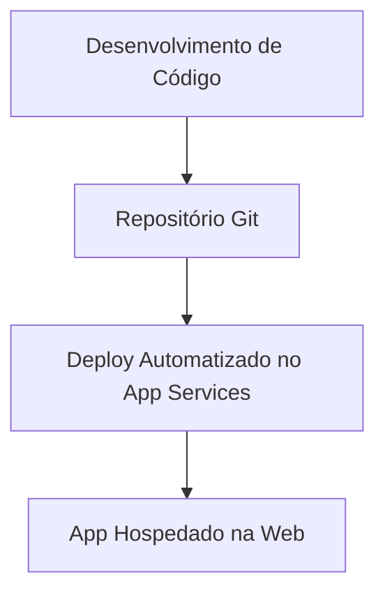

---

# Azure Networking Services - AZ-900

Os **Serviços de Redes do Azure** fornecem uma infraestrutura robusta e segura para conectar recursos dentro e fora da nuvem, garantindo alta disponibilidade, segurança e desempenho para aplicações e dados. Esses serviços facilitam o gerenciamento e a configuração de redes no ambiente de nuvem.

## 📌 Principais Serviços de Rede no Azure

### 1. **Virtual Network (VNet)**
   - Cria uma rede privada no Azure onde você pode conectar recursos como VMs, bancos de dados e serviços de aplicativo.
   - **VNet Peering** permite conectar VNets diferentes, tornando possível a comunicação entre elas, mesmo que estejam em regiões distintas.

### 2. **Azure Load Balancer**
   - Distribui o tráfego de rede entre várias instâncias para garantir disponibilidade e desempenho.
   - Tipos: **Public** (acesso externo) e **Internal** (acesso interno entre VMs).

### 3. **VPN Gateway**
   - Conecta redes locais ao Azure por meio de uma VPN, proporcionando uma conexão segura e criptografada.
   - Suporta **Site-to-Site**, **Point-to-Site** e **ExpressRoute** (conexões privadas com baixa latência).

### 4. **Application Gateway**
   - Balanceador de carga para aplicativos web, com recursos de roteamento inteligente e **Web Application Firewall (WAF)**.
   - Suporta **SSL Offload** e roteamento com base no URL, otimizando a segurança e a performance de aplicativos web.

### 5. **Azure DNS**
   - Hospeda domínios DNS e permite o gerenciamento de registros de DNS para aplicativos hospedados no Azure.

### 6. **Content Delivery Network (CDN)**
   - Rede de distribuição de conteúdo que melhora a performance de entrega de arquivos estáticos (imagens, vídeos, etc.) para usuários finais.

## 🚀 Benefícios dos Serviços de Rede do Azure

1. **Escalabilidade e Desempenho**: Serviços como o Load Balancer e CDN melhoram o desempenho e a experiência do usuário.
2. **Segurança**: Redes privadas (VNets) e serviços de firewall garantem que os dados estejam protegidos.
3. **Conectividade Global**: VPN e ExpressRoute permitem conectar ambientes locais ao Azure de maneira segura.

## 🎯 Pontos para o Exame AZ-900

- **VNet**: Compreender a função das redes virtuais e como elas conectam recursos no Azure.
- **Balanceadores de Carga**: Saber os tipos de balanceadores de carga e quando usar cada um.
- **Conexões Híbridas**: Entender a função de VPN Gateway e ExpressRoute na conexão entre redes locais e o Azure.
- **Content Delivery Network (CDN)**: Saber para que serve o CDN e como ele melhora a entrega de conteúdo estático.

## Exemplo de Arquitetura de Redes com Serviços de Azure

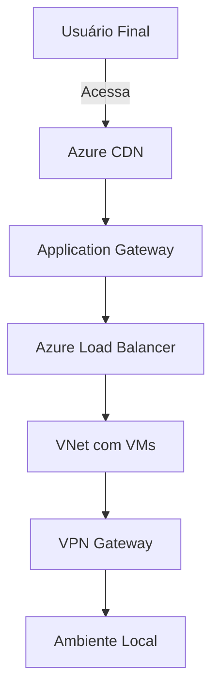

---

### 🎯 Duas Vnet nao se comunica por padrão, necessita de emparelhamento de rede, po questão de segurança evitar ataque lateral. Outro ponto e que geralmente as tem a suas subnet.

---

# VPN Gateway - AZ-900

O **Azure VPN Gateway** é um serviço que permite criar uma conexão de rede segura entre a infraestrutura local e o Azure, utilizando **Virtual Private Network (VPN)**. Esse gateway facilita a criação de conexões criptografadas que garantem a segurança e a privacidade dos dados trafegados entre as redes.

## 📌 Principais Características

- **Conexão Segura e Criptografada**: Usa criptografia IPsec/IKE para manter os dados seguros.
- **Alta Disponibilidade**: Suporta redundância e failover para garantir que a conexão esteja sempre ativa.
- **Diversos Modos de Conexão**: Oferece flexibilidade ao permitir múltiplas configurações de VPN, ajustadas para diferentes cenários de conectividade.

## 🛠️ Tipos de Conexão do VPN Gateway

1. **Site-to-Site (S2S)**:
   - Conecta uma rede local a uma rede virtual no Azure.
   - Ideal para cenários onde várias máquinas da rede local precisam se conectar a recursos na nuvem.

2. **Point-to-Site (P2S)**:
   - Permite que dispositivos individuais (como laptops e desktops) se conectem ao Azure via VPN.
   - Ideal para trabalho remoto ou usuários que precisam acessar a rede de forma segura de qualquer lugar.

3. **ExpressRoute**:
   - Conexão privada e de alta velocidade entre a infraestrutura local e o Azure.
   - Não usa a internet pública, proporcionando menor latência e maior segurança.

## 🚀 Benefícios do VPN Gateway no Azure

1. **Conectividade Híbrida**: Integra facilmente ambientes locais com o Azure, permitindo um ambiente híbrido seguro.
2. **Escalabilidade e Flexibilidade**: Suporta vários tipos de VPN para se adequar a diferentes necessidades de conexão.
3. **Alto Nível de Segurança**: A criptografia avançada IPsec/IKE garante proteção dos dados transmitidos.

## 🎯 Pontos para o Exame AZ-900

- **Conexões Híbridas**: Entender o que é uma conexão híbrida e o papel do VPN Gateway nesse processo.
- **Tipos de Conexões VPN**: Saber as diferenças entre Site-to-Site, Point-to-Site e ExpressRoute.
- **Uso do VPN Gateway**: Compreender cenários em que o VPN Gateway é útil e como ele facilita a conectividade segura entre redes.

## Exemplo de Arquitetura com VPN Gateway


### Express route

- cabo ligado diretamente no datacenter


---

# Área de Trabalho Virtual do Azure (Azure Virtual Desktop) - AZ-900

A **Área de Trabalho Virtual do Azure (AVD)** é uma solução de **virtualização de desktops** e aplicativos, que permite aos usuários acessar ambientes de trabalho Windows completos e aplicativos remotamente. O AVD facilita o trabalho remoto e a colaboração segura, pois os desktops e aplicativos são executados no Azure, permitindo acesso seguro de qualquer lugar.

## 📌 Principais Características

- **Desktops Virtuais Windows**: Permite criar desktops virtuais com o sistema operacional Windows 10 ou Windows 11.
- **Escalabilidade**: Dimensionamento automático com base no número de usuários e demanda de trabalho.
- **Ambiente Multiusuário**: Possibilita que múltiplos usuários compartilhem uma única sessão do Windows 10/11, reduzindo custos e facilitando o gerenciamento.
- **Segurança Integrada**: Aproveita o Azure Active Directory (AAD) e outras ferramentas de segurança para gerenciar o acesso e proteger dados.

## 🛠️ Casos de Uso

1. **Trabalho Remoto Seguro**: Ideal para empresas que precisam fornecer acesso seguro a seus aplicativos e desktops para trabalhadores remotos.
2. **Conformidade e Segurança**: Facilita o atendimento a normas de conformidade, pois os dados permanecem no Azure, protegidos e sob controle da organização.
3. **Suporte a Aplicativos Legados**: Empresas podem acessar e usar aplicativos que exigem o Windows, mesmo que o usuário final esteja em outro sistema operacional.

## 🚀 Benefícios do Azure Virtual Desktop

1. **Redução de Custos com Infraestrutura**: Elimina a necessidade de manter infraestrutura local de servidores e computadores.
2. **Flexibilidade de Acesso**: Usuários podem acessar desktops virtuais a partir de dispositivos diversos, como PCs, tablets e smartphones.
3. **Segurança e Gerenciamento**: AVD integra-se com Azure Security Center e Azure AD, oferecendo opções avançadas de segurança e gerenciamento.

## 🎯 Pontos para o Exame AZ-900

- **Definição de Virtualização de Desktop**: Compreender o conceito e as vantagens de desktops virtuais em comparação com infraestrutura local.
- **Segurança e Escalabilidade**: Saber como o AVD oferece segurança e escalabilidade para suportar o trabalho remoto.
- **Casos de Uso**: Entender os cenários comuns para o uso do AVD, como acesso remoto e redução de custos.

## Exemplo de Arquitetura com Azure Virtual Desktop

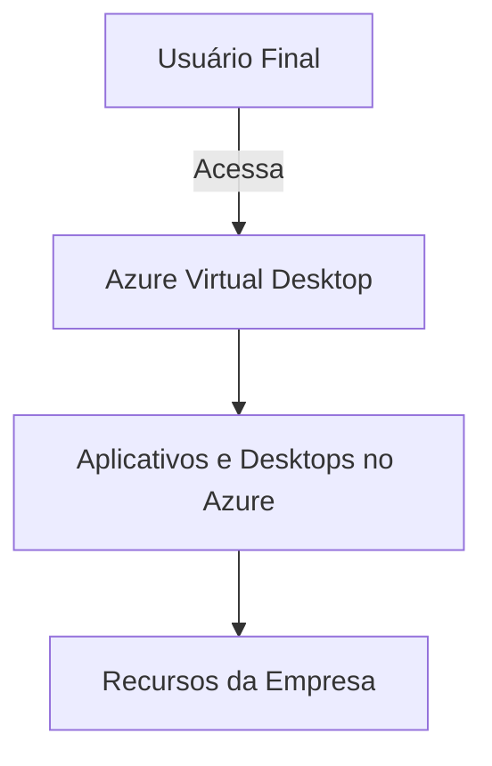

---

# Modolo 02 Arquitetura e Serviço do azure
---
# Redundância e Armazenamento
---


- LRS 03 cópias nomesmo datacenter;
- ZRS 03 cópias em datacenters que forma uma região;
- GRS 01 Datacenter unico no primario e uma região secundária (usa a Estratégia do LRS e vai levar a cópia para outra Região);
- GZRS Usá 03 cópias em datacenters que forma uma região e uma cópia em outra região.

---

A **Redundância de Armazenamento** no Azure garante que os dados estejam protegidos contra falhas de hardware, desastres naturais e interrupções. O Azure oferece várias opções de redundância, permitindo escolher o nível de proteção ideal com base nas necessidades de continuidade de negócios e recuperação de desastres.

## 📌 Tipos de Redundância de Armazenamento no Azure

### 1. **Locally Redundant Storage (LRS)**
   - Armazena três cópias dos dados em um único data center na mesma região.
   - Protege contra falhas de hardware local, mas não cobre falhas ou desastres que afetem todo o data center.
   - **Uso ideal**: Dados que não precisam de alta durabilidade ou requisitos de recuperação regional.

### 2. **Zone-Redundant Storage (ZRS)**
   - Armazena três cópias dos dados em diferentes zonas de disponibilidade dentro da mesma região.
   - Protege contra falhas de zona, garantindo resiliência dentro de uma única região.
   - **Uso ideal**: Aplicações que precisam de alta disponibilidade na mesma região, mas com tolerância a falhas de zona.

### 3. **Geo-Redundant Storage (GRS)**
   - Armazena três cópias dos dados em uma região primária e outras três em uma região secundária, geralmente distante.
   - A replicação é assíncrona, ou seja, dados são enviados para a região secundária com um pequeno atraso.
   - **Uso ideal**: Dados críticos que precisam de recuperação de desastre em uma região secundária.

### 4. **Geo-Zone-Redundant Storage (GZRS)**
   - Combina os benefícios de ZRS e GRS, armazenando dados em várias zonas dentro da região primária e em uma região secundária.
   - Oferece proteção contra falhas tanto em zonas quanto em regiões.
   - **Uso ideal**: Aplicações que precisam de alta durabilidade e recuperação de desastre com resiliência de zona.

## 🚀 Benefícios da Redundância de Armazenamento no Azure

1. **Continuidade dos Negócios**: Proteção contra interrupções e desastres, garantindo a continuidade das operações.
2. **Opções de Recuperação**: Diversas camadas de redundância para atender a diferentes requisitos de recuperação e retenção de dados.
3. **Escalabilidade e Flexibilidade**: Escolha entre opções com custo menor (LRS) a opções com alta disponibilidade e recuperação (GZRS).

## 🎯 Pontos para o Exame AZ-900

- **Entendimento dos Tipos de Redundância**: Saber a diferença entre LRS, ZRS, GRS e GZRS.
- **Cenários de Uso**: Compreender quando usar cada tipo de redundância com base nos requisitos de recuperação e disponibilidade.
- **Proteção e Resiliência**: Conhecer as vantagens de redundância para continuidade de negócios e recuperação de desastre.

## Exemplo de Redundância de Armazenamento no Azure

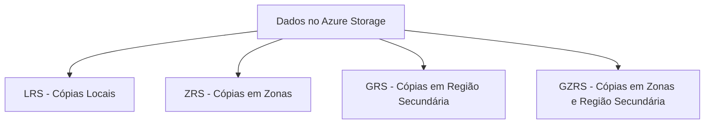
---


- - L = Local
  - Z = Zone
  - RS =  redundancy storage
  - G = geographic
  - GR = geographic / Region
  - GZ = geographic / Zone

---

# Serviços de Armazenamento no Azure - AZ-900

O **Armazenamento no Azure** oferece uma variedade de serviços que atendem a diferentes tipos de dados e necessidades, permitindo que as empresas armazenem, acessem e gerenciem informações de forma segura e escalável.

## 📦 Azure Blob Storage

O **Blob Storage** é otimizado para armazenar grandes volumes de dados não estruturados, como arquivos de mídia, documentos e backups.

- **Tipos de Blob**:
  - **Blobs de Blocos**: Armazenam dados como arquivos de vídeo, imagens e documentos.
  - **Blobs de Páginas**: Usados em VMs para armazenamento de discos de leitura/gravação de alta performance.
  - **Blobs de Acrescento**: Permitem apenas adicionar dados, adequados para logs e auditorias.
- **Casos de Uso**: Armazenamento de mídia, dados de backup e dados de análise.

## 💽 Disco do Azure (Azure Disk)

O **Azure Disk** fornece armazenamento persistente para **máquinas virtuais (VMs)**. Ele é ideal para dados que precisam ser acessados rapidamente e de forma confiável por VMs.

- **Tipos de Disco**:
  - **Discos Gerenciados**: Gerenciados pelo Azure, facilitam o gerenciamento e a escalabilidade.
  - **Discos Não Gerenciados**: Exigem que o usuário gerencie o armazenamento em contas de armazenamento.
- **Casos de Uso**: Hospedagem de dados de sistemas operacionais e aplicativos que precisam de armazenamento persistente.

## 📬 Fila do Azure (Azure Queue)

O **Azure Queue** é um serviço que armazena grandes volumes de mensagens e permite que diferentes componentes de uma aplicação comuniquem-se de maneira assíncrona.

- **Características**:
  - Suporta mensagens de até 64 KB.
  - Integra-se facilmente com outros serviços, como Azure Functions.
- **Casos de Uso**: Balanceamento de carga, processamento assíncrono e gerenciamento de tarefas.

## 📂 Arquivos do Azure (Azure Files)

O **Azure Files** oferece um sistema de arquivos totalmente gerenciado e acessível via **protocolo SMB** (Server Message Block). É ideal para compartilhar arquivos entre múltiplas VMs e usuários.

- **Características**:
  - Compatível com SMB 3.0 para suporte a compartilhamento de arquivos.
  - Permite sincronização com servidores Windows locais.
- **Casos de Uso**: Compartilhamento de arquivos entre VMs e sincronização de dados entre ambientes locais e o Azure.

## 📊 Tabelas do Azure (Azure Table)

O **Azure Table** fornece armazenamento NoSQL para dados estruturados em grandes volumes e permite que dados sejam acessados rapidamente.

- **Características**:
  - Ideal para dados com chave-valor e consultas rápidas.
  - Tabela de baixo custo e alta escalabilidade.
- **Casos de Uso**: Armazenamento de logs, catálogos de produtos e dados de sensores IoT.

## 🌐 Pontos de Extremidade

Os **Pontos de Extremidade** são URLs exclusivos para acessar os recursos de armazenamento no Azure. Cada serviço de armazenamento tem pontos de extremidade para facilitar o acesso e a segregação dos dados.

- **Tipos de Pontos de Extremidade**:
  - **Público**: Acessível pela internet e geralmente usado por padrão.
  - **Privado**: Conectado a uma rede virtual para acesso seguro e isolado, limitando a exposição pública.
- **Casos de Uso**: Controle de acesso e segurança, gerenciamento de dados sensíveis com acesso restrito.


## 📦 Camadas de acesso


- **Arquivo Morto**: Comumente usado para backup e tem um sla
  
## 🎯 Pontos para o Exame AZ-900

- **Identificação dos Serviços de Armazenamento**: Compreender as diferenças entre Blob Storage, Disco do Azure, Fila do Azure, Arquivos do Azure e Tabelas do Azure.
- **Cenários de Uso**: Saber quando usar cada tipo de armazenamento com base em requisitos de dados e disponibilidade.
- **Pontos de Extremidade**: Conhecer as funções de pontos de extremidade públicos e privados.
  
---

# Migrações para o Azure - AZ-900

Migrar para o Azure permite que as organizações aproveitem a escalabilidade, segurança e economia da nuvem. A Microsoft oferece ferramentas e serviços para ajudar a realizar essa migração com o mínimo de interrupção, fornecendo suporte para avaliar, migrar e otimizar cargas de trabalho.

## 🧰 Ferramentas de Migração para o Azure

1. **Azure Migrate**
   - Plataforma centralizada que ajuda a avaliar e migrar cargas de trabalho locais para o Azure.
   - Suporta migração de máquinas virtuais (VMs), bancos de dados, aplicativos, dados e ambientes VMware/Hyper-V.
   - **Características**: Oferece um painel para monitorar o status da migração e insights de otimização.

2. **Database Migration Service (DMS)**
   - Serviço gerenciado que facilita a migração de bancos de dados para o Azure com mínima interrupção.
   - Suporta bancos de dados SQL e NoSQL, como SQL Server, MySQL, PostgreSQL e MongoDB.
   - **Características**: Migração online (com mínima interrupção) e offline, dependendo do cenário.

3. **Data Box**
   - Dispositivo físico para transferir grandes volumes de dados de maneira rápida e segura para o Azure.
   - Ideal para cenários onde a largura de banda de rede não é suficiente para transferir grandes quantidades de dados e ou locais remotos.
   - Armazena ate **80** Terabytes de dados.
   - **Características**: Suporta várias opções de dispositivo, como Data Box Disk, Data Box, e Data Box Heavy, para diferentes tamanhos de carga.

4. **Azure Site Recovery (ASR)**
   - Ferramenta que oferece suporte para **continuidade de negócios** e **recuperação de desastres** (BCDR).
   - Permite replicar máquinas virtuais e servidores locais para o Azure, garantindo que, em caso de falha, as operações possam ser rapidamente retomadas.
   - **Características**: Replica dados em tempo real e permite o failover de aplicações críticas para o Azure.
  
5. **AzCopy**
   - É uma ferramenta de linha de comando que facilita a transferência de dados para e do armazenamento do Azure. É otimizada para operações de upload, download e cópia de grandes quantidades de dados entre o armazenamento local e o Azure Storage, incluindo blobs, arquivos e contêineres.
     
 6. **Gerenciador de Armazenamento do Azure**
    - Interface Gráfica (Semelhante ao Windos Explorer)
    - Compatível com Window, MacOs e Linux

## 🔄 Fases do Processo de Migração

1. **Avaliação**
   - Usando o Azure Migrate, é possível avaliar a infraestrutura existente, determinando compatibilidade e requisitos de recurso para a nuvem.
   - Identifica custo estimado e estratégias de otimização para adaptar melhor as cargas ao Azure.

2. **Migração**
   - Depois de avaliar, inicia-se a migração com ferramentas apropriadas, como o **DMS** para bancos de dados ou o **Azure Migrate** para máquinas virtuais.
   - Pode envolver uma migração "Lift-and-Shift" (transposição direta) ou uma modernização de aplicativos para aproveitar serviços nativos da nuvem.

3. **Otimização**
   - Após a migração, recomenda-se otimizar os recursos usando recomendações do **Azure Advisor** para ajustar o desempenho, a segurança e os custos.
   - Possibilita ajustes no dimensionamento e na configuração dos serviços para maximizar os benefícios da nuvem.

## 🎯 Pontos para o Exame AZ-900

- **Ferramentas de Migração**: Entender o papel de Azure Migrate, DMS, Data Box e Azure Site Recovery.
- **Fases de Migração**: Saber as etapas de avaliação, migração e otimização.
- **Opções de Migração**: Compreender os tipos de migração disponíveis (Lift-and-Shift, modernização) e as opções de continuidade de negócios.

## Exemplo de Fluxo de Migração com Azure Migrate

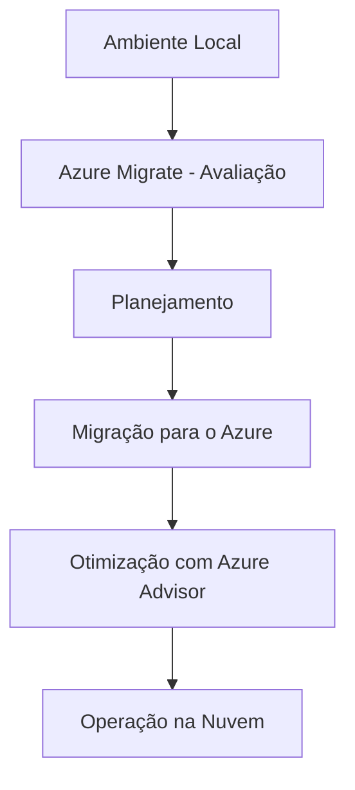

---

# Laboratório dúvidas 


# Protocolos para Acesso a Compartilhamentos de Arquivos do Azure

## Protocolos Disponíveis

### SMB (Server Message Block)
- **Descrição**: Protocolo de comunicação usado para compartilhamento de arquivos, impressoras e portas seriais entre nós em uma rede.
- **Compatibilidade**: Principalmente utilizado por sistemas Windows.
- **Recursos**:
  - Suporte a criptografia de canal SMB.
  - SMB Multichannel para alta taxa de transferência.
  - Permite o mapeamento de compartilhamentos de arquivos diretamente no sistema de arquivos local.

### NFS (Network File System)
- **Descrição**: Protocolo que permite que um usuário em um computador cliente acesse arquivos através de uma rede da mesma maneira que acessaria o armazenamento local.
- **Compatibilidade**: Utilizado principalmente por sistemas Linux e Unix.
- **Recursos**:
  - Acesso a compartilhamentos de arquivos em sistemas Linux e outros compatíveis com NFS.
  - Suporte a grandes volumes de dados e alta escalabilidade.
  - Ideal para ambientes que utilizam cargas de trabalho de leitura intensiva.

## Benefícios dos Compartilhamentos de Arquivos do Azure
- **Escalabilidade**: Capacidade de crescer conforme a demanda.
- **Alta Disponibilidade**: Compartilhamentos de arquivos disponíveis em diferentes regiões e com redundância integrada.
- **Segurança**: Integração com Azure Active Directory para controle de acesso e políticas de segurança.

## Conclusão
Os compartilhamentos de arquivos do Azure oferecem flexibilidade e eficiência para diversas cargas de trabalho, permitindo o uso dos protocolos SMB e NFS para acesso a arquivos de maneira segura e escalável.

---

# Controle de Acesso Condicional com Azure AD

## O que é Acesso Condicional?
O Acesso Condicional do Azure Active Directory (Azure AD) é uma ferramenta essencial que ajuda a proteger aplicativos e dados, garantindo que apenas dispositivos compatíveis possam acessar esses recursos.

## Como Funciona?
O Acesso Condicional permite que você crie políticas baseadas em condições, como a conformidade do dispositivo, a localização e o risco de login, para controlar o acesso a aplicativos e dados corporativos.

## Principais Recursos
- **Políticas baseadas em risco**: Avaliam o risco de login e a conformidade do dispositivo.
- **Autenticação multifator (MFA)**: Requer várias formas de verificação.
- **Bloqueio de dispositivos não compatíveis**: Impede que dispositivos não gerenciados ou não conformes acessem aplicativos.

## 🎯 Pontos para o Exame AZ-900

- **Acesso Condicional**: Entender como criar e gerenciar políticas de acesso condicional no Azure AD.
- **Dispositivos Compatíveis**: Saber como garantir que apenas dispositivos que atendam aos critérios de conformidade possam acessar recursos.
- **Autenticação Multifator (MFA)**: Importância e implementação de MFA para aumentar a segurança.
- **Controle de Acesso**: Compreender as várias opções de controle de acesso fornecidas pelo Azure AD para proteger recursos corporativos.

## Exemplo de Política de Acesso Condicional
Yaml
Se um usuário tentar acessar um aplicativo corporativo e não estiver usando um dispositivo compatível, ele será bloqueado.
- Condição: Dispositivos não compatíveis
- Ação: Bloquear acesso


# O que pode ser usado para sincronizar as identidades de um domínio local do Active Directory Domain Services (AD DS) com o locatário do Microsoft Entra?
## Sincronização de Identidades com Microsoft Entra Connect

## O que é Microsoft Entra Connect?
O Microsoft Entra Connect é uma ferramenta que permite a sincronização de identidades e recursos entre um ambiente local do Active Directory Domain Services (AD DS) e o Microsoft Entra ID na nuvem[_{{{CITATION{{{_1{Como funciona a sincronização no Microsoft Entra Domain Services ...](https://bing.com/search?q=sincronizar+identidades+dom%c3%adnio+local+AD+DS+com+Microsoft+Entra).

## Benefícios da Sincronização
- **Autenticação Unificada:** Permite que os usuários acessem aplicativos e recursos com um único conjunto de credenciais.
- **Gerenciamento Simplificado:** Facilita a gestão de identidades e acesso em um ambiente híbrido.
- **Segurança Aumentada:** Garante que as políticas de segurança locais sejam aplicadas na nuvem.

## Como Funciona?
1. **Instalação:** Instale o Microsoft Entra Connect no servidor local.
2. **Configuração:** Execute o assistente de configuração para conectar o AD DS local ao Microsoft Entra ID[_{{{CITATION{{{_1{Como funciona a sincronização no Microsoft Entra Domain Services ...](https://bing.com/search?q=sincronizar+identidades+dom%c3%adnio+local+AD+DS+com+Microsoft+Entra).
3. **Sincronização:** Configure a sincronização de contas de usuário, associações de grupo e hashes de credenciais[_{{{CITATION{{{_1{Como funciona a sincronização no Microsoft Entra Domain Services ...](https://bing.com/search?q=sincronizar+identidades+dom%c3%adnio+local+AD+DS+com+Microsoft+Entra).
4. **Manutenção:** A sincronização é realizada automaticamente em segundo plano, mantendo os dados atualizados.

## 🎯 Pontos para o Exame AZ-900

- **Microsoft Entra Connect:** Compreender a ferramenta e seu papel na sincronização de identidades.
- **Sincronização de Identidades:** Saber como sincronizar contas de usuário, associações de grupo e hashes de credenciais.
- **Ambiente Híbrido:** Entender como gerenciar identidades em um ambiente híbrido com AD DS local e Microsoft Entra ID.


#Você precisa comparar os custos de execução de um aplicativo em um datacenter local com os custos de execução do aplicativo no Azure.
O que você deve usar para ajudar?

## Comparação de Custos com a Calculadora de Custo Total de Propriedade (TCO)

## O que é a Calculadora de Custo Total de Propriedade (TCO)?
A Calculadora de Custo Total de Propriedade (TCO) do Azure é uma ferramenta que ajuda a estimar os custos totais de operação de um aplicativo, incluindo custos de infraestrutura, manutenção, energia e pessoal, comparando-os com os custos na nuvem.

## Como Usar a Calculadora TCO
1. **Acessar a Calculadora:** Visite a [Calculadora de Custo Total de Propriedade (TCO) do Azure](https://azure.microsoft.com/en-us/pricing/tco/calculator/).
2. **Inserir Informações Locais:** Forneça detalhes sobre o ambiente local, como servidores, armazenamento, licenciamento e custos operacionais.
3. **Configurar Cenário na Nuvem:** Selecione os serviços do Azure que você planeja usar.
4. **Comparar Custos:** A calculadora fornecerá um relatório detalhado comparando os custos operacionais locais com os da nuvem, ajudando a identificar potenciais economias.

## 🎯 Pontos para o Exame AZ-900

- **Calculadora TCO:** Compreender como usar a ferramenta para comparar os custos de infraestrutura local com a nuvem.
- **Custos Totais de Propriedade:** Saber identificar todos os componentes de custo, incluindo hardware, manutenção e energia.
- **Planejamento de Migração:** Utilizar a TCO para planejar a migração para o Azure de forma eficiente e econômica.

---

# O que você pode usar para restringir a implantação de uma máquina virtual a um local específico?
## Azure Policy

## O que é o Azure Policy?
O Azure Policy é uma ferramenta de governança que ajuda a impor padrões organizacionais e a avaliar a conformidade em escala. Ele permite que você crie, atribua e gerencie definições de políticas em seu ambiente do Azure.

## Benefícios do Azure Policy
- **Governança Consistente:** Garante que todos os recursos estejam em conformidade com as políticas definidas.
- **Conformidade Regulatória:** Ajuda a atender a requisitos regulatórios e padrões da indústria.
- **Segurança Aumentada:** Impõe políticas de segurança para proteger recursos.
- **Otimização de Custos:** Controla e otimiza os gastos com a nuvem.

## Como Funciona?
1. **Definição de Políticas:** Crie definições de políticas em formato JSON que descrevem as regras de negócios[_{{{CITATION{{{_1{Visão geral do Azure Policy - Azure Policy | Microsoft Learn](https://learn.microsoft.com/pt-br/azure/governance/policy/overview).
2. **Atribuição de Políticas:** Atribua essas políticas a grupos de gerenciamento, assinaturas, grupos de recursos ou recursos individuais[_{{{CITATION{{{_1{Visão geral do Azure Policy - Azure Policy | Microsoft Learn](https://learn.microsoft.com/pt-br/azure/governance/policy/overview).
3. **Avaliação de Conformidade:** O Azure Policy avalia continuamente os recursos e relata a conformidade em um painel centralizado[_{{{CITATION{{{_1{Visão geral do Azure Policy - Azure Policy | Microsoft Learn](https://learn.microsoft.com/pt-br/azure/governance/policy/overview).
4. **Correção Automática:** Corrija recursos não conformes automaticamente ou por meio de tarefas de correção programadas[_{{{CITATION{{{_2{Azure Policy Cloud e gerenciamento de conformidade | Microsoft Azure](https://azure.microsoft.com/pt-br/products/azure-policy/).

## 🎯 Pontos para o Exame AZ-900

- **Definição de Políticas:** Compreender como criar definições de políticas em formato JSON[_{{{CITATION{{{_1{Visão geral do Azure Policy - Azure Policy | Microsoft Learn](https://learn.microsoft.com/pt-br/azure/governance/policy/overview).
- **Atribuição de Políticas:** Saber como atribuir políticas a diferentes escopos de recursos[_{{{CITATION{{{_1{Visão geral do Azure Policy - Azure Policy | Microsoft Learn](https://learn.microsoft.com/pt-br/azure/governance/policy/overview).
- **Avaliação de Conformidade:** Entender como o Azure Policy avalia a conformidade dos recursos[_{{{CITATION{{{_1{Visão geral do Azure Policy - Azure Policy | Microsoft Learn](https://learn.microsoft.com/pt-br/azure/governance/policy/overview).
- **Correção Automática:** Conhecer as opções de correção automática para recursos não conformes[_{{{CITATION{{{_2{Azure Policy Cloud e gerenciamento de conformidade | Microsoft Azure](https://azure.microsoft.com/pt-br/products/azure-policy/).

---

Você tem uma equipe de administradores do Linux que precisa gerenciar os recursos no Azure. A equipe deseja usar o shell bash para executar a administração. O que você deve recomendar?

## Azure CLI e Azure PowerShell

## Azure CLI 🚀

**Azure Command-Line Interface (CLI)** é uma ferramenta de linha de comando multiplataforma que permite gerenciar recursos do Azure de maneira rápida e eficiente.

### Principais Recursos
- **Gerenciamento de Recursos**: Criação, configuração e monitoramento de recursos do Azure.
- **Automação**: Facilita a automação de tarefas usando scripts.
- **Interatividade**: Oferece um modo interativo para executar comandos de maneira mais intuitiva.

## Azure PowerShell 🔧

**Azure PowerShell** é um conjunto de módulos que oferece comandos para gerenciar o Azure diretamente do PowerShell. Ideal para administradores familiarizados com o ambiente PowerShell no Windows.

### Principais Recursos
- **Administração de Recursos**: Gerenciamento completo dos recursos do Azure.
- **Automatização**: Uso de scripts para automatizar tarefas rotineiras.
- **Compatibilidade**: Pode ser usado em qualquer plataforma que suporte PowerShell, incluindo Windows, macOS e Linux.

## 🎯 Pontos para o Exame AZ-900

- **Azure CLI**: Compreender os comandos básicos e seu uso para gerenciar recursos do Azure.
- **Azure PowerShell**: Saber como utilizar cmdlets para administração e automação de recursos no Azure.
- **Automação**: Importância da automação de tarefas usando scripts e ferramentas de linha de comando.

---


# Qual serviço do Azure avalia os recursos do Azure e faz recomendações para ajudar a melhorar a confiabilidade, a segurança, o desempenho e a redução de custos?

## 🔍 _Azure Advisor_

O **Azure Advisor** é o serviço do Azure que analisa recursos e fornece recomendações para melhorar a **confiabilidade**, **segurança**, **desempenho** e **redução de custos**. Ele atua como um **consultor personalizado** que ajuda a otimizar o ambiente do Azure.

## 📊 Principais Funcionalidades

- **Confiabilidade (Alta Disponibilidade)** 🛠️: Identifica maneiras de tornar os recursos mais resilientes a falhas.
- **Segurança** 🔒: Recomenda práticas de segurança, como configuração de firewalls e criptografia, para proteger dados e recursos.
- **Desempenho** ⚙️: Sugere ajustes de configuração para melhorar o desempenho dos recursos.
- **Redução de Custos** 💰: Fornece orientações para economizar, como redimensionar ou desativar recursos subutilizados.

## 🛠 Como o Azure Advisor Funciona

O Advisor analisa continuamente a configuração dos recursos e gera um painel com recomendações classificadas por prioridade. Cada recomendação inclui orientações para implementação e um impacto esperado para o ambiente.

## 🎯 Benefícios do Azure Advisor

- **Proatividade**: Ajuda a antecipar problemas e oportunidades de otimização.
- **Fácil Acesso**: Disponível diretamente no **Azure Portal**, com alertas e relatórios personalizáveis.
- **Economia e Eficiência**: Permite ajustar o ambiente para ser mais econômico e eficiente, promovendo boas práticas.

---


Para acessar o relatório de **Análise de Causa Raiz (Root Cause Analysis - RCA)** de uma interrupção de serviço recente no Azure, você deve procurar no:

---

# Você precisa examinar o relatório de análise de causa raiz (RCA) para uma interrupção de serviço que ocorreu na semana passada. Onde você deve procurar o relatório?

## 🗂 _**Azure Service Health**_

O **Azure Service Health (integridade de serviço)** é o serviço oficial que fornece informações detalhadas sobre o estado dos serviços do Azure, incluindo:

- **Incidentes de Serviço Atuais** 🔍: Atualizações em tempo real sobre interrupções e problemas.
- **Análise de Causa Raiz (RCA)** 📄: Após a resolução de uma interrupção, o Azure disponibiliza um relatório de RCA para identificar a causa raiz e as ações corretivas adotadas.
- **Histórico de Incidentes** 📅: Acessa incidentes anteriores e seus relatórios RCA para consulta.

## 🔑 Como Acessar o RCA no Azure Service Health:

1. Acesse o **Azure Portal**.
2. Navegue até **Azure Service Health**.
3. Confira a seção de **Histórico de Incidentes** e selecione a interrupção desejada.
4. O relatório de RCA estará disponível, detalhando a causa do incidente e as medidas corretivas tomadas.

---


Aqui está uma comparação entre o **Azure Monitor** e o **Azure Advisor** para ajudar a entender as diferenças:

---

# Comparação: Azure Monitor vs Azure Advisor

## 📊 **Azure Monitor**

**Azure Monitor** é uma ferramenta de **monitoramento** e **observabilidade** que coleta, analisa e armazena dados de **telemetria** e **logs** dos recursos e aplicativos no Azure. Ele ajuda a acompanhar o desempenho e a integridade dos recursos em tempo real.

### Principais Características:
- **Métricas e Logs** 📈: Coleta métricas de desempenho e logs de diagnóstico de recursos, redes e aplicativos.
- **Análise de Dados** 🔍: Utiliza o Log Analytics para consultas avançadas e insights detalhados sobre o ambiente.
- **Alertas e Notificações** 🚨: Configura alertas para responder a eventos específicos ou problemas de desempenho.
- **Visualizações** 📊: Oferece dashboards personalizáveis para exibir métricas e logs em tempo real.

### Casos de Uso:
- Monitoramento de desempenho de VMs, bancos de dados e aplicativos.
- Configuração de alertas automáticos para notificações de problemas.
- Análise de logs para resolução de problemas complexos.
- **Os dados podem ser usados para disparar o dimensionamento automático**.

---

# Você precisa ser notificado quando houver novas recomendações para reduzir os custos do Azure. Qual ferramenta deve ser usada?

## 🧑‍💼 _**Azure Advisor (Assistente)**_

**Azure Advisor** é uma ferramenta de **recomendações** que analisa os recursos do Azure e sugere melhorias para otimizar a **segurança**, **desempenho**, **alta disponibilidade** e **custos**. Ele é focado em **boas práticas** e ajuda a manter o ambiente otimizado.

### Principais Características:
- **Recomendações de Segurança** 🔒: Sugere configurações para melhorar a segurança do ambiente.
- **Economia de Custos** 💰: Identifica recursos subutilizados ou inativos para reduzir custos.
- **Desempenho e Alta Disponibilidade** ⚙️: Propõe ajustes que podem melhorar o desempenho e a resiliência dos recursos.
- **Facilidade de Acesso** 📋: Reúne todas as recomendações em um painel central no Azure Portal.

### Casos de Uso:
- Otimização de custos, como redimensionamento de VMs e remoção de recursos inativos.
- Reforço de segurança com políticas de conformidade recomendadas.
- Melhoria da resiliência e da eficiência dos recursos.


---

## 🔑 Resumo da Diferença

| Característica                 | **Azure Monitor**                                           | **Azure Advisor**                                             |
|--------------------------------|-------------------------------------------------------------|----------------------------------------------------------------|
| **Função Principal**           | Monitoramento e observação em tempo real                    | Recomendações de otimização e melhores práticas                |
| **Foco**                       | Coleta de dados, métricas e logs                            | Otimização de desempenho, custo, segurança e resiliência       |
| **Casos de Uso**               | Alertas, resolução de problemas, monitoramento contínuo     | Economia de custos, ajuste de configurações e melhorias gerais |
| **Dados Disponíveis**          | Métricas de telemetria e logs dos recursos                  | Sugestões e recomendações no painel do Azure Advisor           |

---

Essas ferramentas, embora complementares, servem a propósitos diferentes: **Azure Monitor** foca no monitoramento contínuo, enquanto o **Azure Advisor** oferece recomendações para otimização e melhorias.

---


# O que você deve revisar e agir proativamente sobre para evitar interrupções de serviço, como aposentadorias de serviços e alterações interruptivas?

### No **Azure**, os **Avisos de Integridade** são notificações enviadas pelo **Azure Service Health** para alertar sobre problemas que afetam a integridade dos serviços e recursos específicos em uma região ou ambiente. Esses avisos permitem que os administradores fiquem informados sobre **incidentes ativos**, **manutenções planejadas** e outros eventos críticos que possam impactar o desempenho dos serviços.

---

## 🔔 Avisos de Integridade no Azure Service Health

**Azure Service Health** gera três tipos principais de avisos para acompanhar e responder a problemas que possam afetar a **disponibilidade e integridade** dos recursos no Azure:

## 📅 1. Incidentes de Serviço
- **O que é**: Notificações sobre interrupções inesperadas ou problemas críticos que afetam os serviços.
- **Exemplo**: Uma interrupção regional que impacta o acesso a VMs, bancos de dados ou outros recursos.
- **Ação**: Azure fornece atualizações em tempo real sobre o status do incidente e possíveis soluções.

## 🛠 2. Manutenção Planejada
- **O que é**: Informações sobre manutenção programada para melhorias ou atualizações de serviço.
- **Exemplo**: Atualizações de sistema em VMs ou ajustes de rede em data centers específicos.
- **Ação**: Permite que os administradores se preparem e ajustem seus sistemas para minimizar o impacto.

## ⚠️ 3. Avisos de Integridade de Recursos
- **O que é**: Alertas personalizados sobre problemas específicos que afetam apenas os recursos de uma assinatura.
- **Exemplo**: Falha em um serviço de banco de dados devido a problemas de configuração específicos.
- **Ação**: Ajuda os administradores a resolverem rapidamente problemas específicos que podem afetar o desempenho de seus recursos.

---

## 🔑 Acessando Avisos de Integridade

1. Acesse o **Azure Portal**.
2. Navegue até **Azure Service Health**.
3. Confira os **Avisos de Integridade** para ver informações sobre incidentes, manutenções e problemas ativos.

## 🎯 Benefícios dos Avisos de Integridade

- **Visão Geral Completa**: Mantém as equipes informadas sobre o status dos serviços e recursos em tempo real.
- **Proatividade**: Permite tomar medidas preventivas para mitigar o impacto de problemas antes que afetem o usuário final.
- **Alertas Personalizáveis**: Configura notificações e alertas para se manter atualizado sobre eventos críticos de integridade.

---

**Azure Service Health** e seus avisos de integridade são essenciais para garantir que os recursos do Azure estejam sempre monitorados e que ações corretivas possam ser tomadas rapidamente em caso de problemas.
---

# O que você pode usar para detectar automaticamente anomalias de desempenho para aplicativos Web?

## 🔍 Azure Application Insights

**Azure Application Insights** é uma ferramenta integrada ao **Azure Monitor** que fornece **monitoramento de desempenho de aplicativos** (APM) para identificar e diagnosticar problemas em tempo real. Ele é projetado para ajudar desenvolvedores e equipes de operações a acompanhar o desempenho e o uso de **aplicativos web**, **API** e **aplicativos móveis** hospedados na nuvem ou em ambientes locais.

## 🚀 Principais Funcionalidades do Application Insights

1. **Monitoramento de Desempenho** ⚙️
   - Coleta dados em tempo real sobre o desempenho de páginas, tempos de resposta, contagens de solicitações e mais.
   - Permite entender onde o tempo de carregamento é mais longo ou onde o desempenho precisa de melhorias.

2. **Telemetria de Dependência** 🔗
   - Monitora dependências externas, como chamadas a bancos de dados, APIs e serviços externos.
   - Identifica falhas e gargalos nas conexões com serviços de terceiros.

3. **Mapeamento de Aplicativos e Detecção de Anomalias** 📊
   - Cria mapas visuais para mostrar interações entre diferentes componentes de um aplicativo.
   - Detecta automaticamente anomalias de desempenho e envia alertas para ações corretivas.

4. **Coleta de Logs e Análise de Logs** 🗂️
   - Registra eventos detalhados, exceções e logs personalizados para diagnóstico de problemas.
   - Utiliza o **Log Analytics** para consultas avançadas e visualização de tendências.

5. **Experiência do Usuário** 👤
   - Rastreia métricas de uso, comportamento do usuário e desempenho de páginas.
   - Permite análises detalhadas de como os usuários interagem com o aplicativo e onde melhorias podem ser feitas.

## 🎯 Casos de Uso do Application Insights

- **Detecção de Problemas**: Identificação de falhas e problemas de desempenho em aplicativos de produção.
- **Diagnóstico de Erros**: Monitoramento de exceções, falhas e análise de logs para resolver problemas rapidamente.
- **Monitoramento de APIs**: Medição de tempo de resposta e confiabilidade de endpoints de API.
- **Análise de Comportamento do Usuário**: Compreensão do uso de recursos e da jornada do usuário no aplicativo.

## 💻 Como Funciona

1. **Instrumentação**: Pode ser implementado com um SDK diretamente no código do aplicativo (disponível para várias linguagens, como .NET, Java, Python).
2. **Coleta de Dados**: Registra dados de desempenho e eventos em tempo real, enviando-os para o **Azure Monitor**.
3. **Consultas e Relatórios**: Os dados são analisados e visualizados por meio do Log Analytics e de dashboards personalizáveis no Azure Portal.

## 📝 Benefícios do Azure Application Insights

- **Visibilidade Completa**: Permite acompanhar a integridade de todos os aspectos do aplicativo, do cliente à infraestrutura.
- **Alertas Proativos**: Envia notificações em tempo real para problemas de desempenho ou falhas críticas.
- **Insights Detalhados**: Auxilia na otimização de desempenho, reduzindo o tempo de resposta e melhorando a experiência do usuário.
- **Integração Fácil**: Pode ser integrado a várias ferramentas de DevOps e CI/CD, como GitHub e Azure DevOps.

---

O **Azure Application Insights** é uma ferramenta essencial para acompanhar o **desempenho e confiabilidade** de aplicativos modernos, sendo especialmente útil para equipes que buscam melhorar a experiência do usuário e resolver problemas de maneira proativa.


No **Microsoft Purview**, o recurso para gerenciar o acesso a **fontes de dados** e **conjuntos de dados** é o:

---

# Qual recurso no portal de governança do Microsoft Purview você deve usar para gerenciar o acesso a fontes de dados e conjuntos de dados?

## 🔒 _**Microsoft Purview Access Policies**_

O **Microsoft Purview Access Policies** é um recurso que permite definir e gerenciar políticas de acesso a fontes de dados e conjuntos de dados em ambientes de nuvem, de maneira centralizada e segura. Ele é especialmente útil para garantir que o acesso a dados sensíveis esteja **controlado e conforme as políticas de governança** da organização.

## 🎯 Funcionalidades do Purview Access Policies

- **Gerenciamento Centralizado** 🗂️: Consolida a gestão de acesso em uma interface central, simplificando a administração de permissões para múltiplos conjuntos de dados e fontes.
- **Controle de Acesso com Base em Funções** 🔐: Utiliza o modelo de controle baseado em funções (RBAC) para definir permissões por função ou usuário.
- **Conformidade e Segurança** 📜: Facilita a conformidade com regulamentos de privacidade e segurança, como GDPR, restringindo o acesso a dados sensíveis.
- **Facilidade de Integração** 🔄: Integra-se facilmente com outras soluções do Azure e permite que administradores e equipes de governança definam políticas de acesso consistentes para todas as fontes de dados registradas.

## 🛠️ Como Usar o Purview Access Policies

1. **Configuração de Políticas**: Acesse o **Purview Studio** no portal do Azure e navegue até a seção **Access Policies**.
2. **Definição de Permissões**: Crie políticas que especifiquem quem pode acessar quais conjuntos de dados e em qual nível.
3. **Aplicação de Políticas**: Associe políticas às fontes de dados para implementar controle de acesso.

---

O **Microsoft Purview Access Policies** é uma ferramenta essencial para equipes de governança de dados que desejam garantir um gerenciamento de acesso **centralizado e seguro** no ambiente Azure.

---

# 🌐 Azure IoT: Central, Hub e Sphere

## 1. **Azure IoT Central**

**Azure IoT Central** é uma plataforma **gerenciada de IoT** que permite desenvolver, gerenciar e monitorar soluções de IoT rapidamente, com pouca necessidade de configuração. Ideal para empresas que querem uma solução de IoT escalável e com baixo custo de manutenção.

### Características:
- **Interface Intuitiva** 🖥️: Fornece uma interface de fácil uso para monitorar dispositivos e gerenciar dados.
- **Modelos de Aplicação** 📋: Oferece templates para diferentes indústrias, facilitando a configuração de soluções personalizadas.
- **Monitoramento e Alertas em Tempo Real** 🚨: Permite monitorar dispositivos, definir alertas e gerar relatórios sem necessidade de gerenciamento de infraestrutura.

### Casos de Uso:
- **Gestão de Dispositivos**: Gerenciamento e monitoramento de dispositivos IoT, como sensores e atuadores.
- **Escalabilidade**: Ideal para empresas que desejam expandir suas operações de IoT sem gerenciar infraestrutura de servidor.

---

## 2. **Azure IoT Hub**

**Azure IoT Hub** é um serviço de comunicação bidirecional para conectar, monitorar e gerenciar dispositivos IoT em larga escala. Ele é mais flexível do que o IoT Central e permite um controle mais detalhado da infraestrutura de IoT.

### Características:
- **Mensageria Bidirecional** 🔄: Suporta envio de mensagens entre dispositivos e o backend, permitindo o monitoramento e o envio de comandos.
- **Autenticação e Segurança** 🔒: Oferece autenticação baseada em tokens e suporte para certificados X.509 para comunicação segura.
- **Integração com Serviços do Azure** 🧩: Integra-se com outros serviços como Azure Machine Learning, Azure Stream Analytics e Azure Storage.

### Casos de Uso:
- **Monitoramento e Comandos Remotos**: Gerenciamento em tempo real de grandes quantidades de dispositivos, enviando e recebendo mensagens em escala.
- **IoT Personalizável e Escalável**: Ideal para soluções personalizadas que exigem mais controle e integração com outras ferramentas do Azure.

---

## 3. **Azure Sphere**

**Azure Sphere** é uma solução de segurança para dispositivos IoT que inclui **hardware**, **sistema operacional** e **serviço de segurança** em nuvem, garantindo proteção de ponta a ponta para dispositivos conectados.

### Características:
- **Microcontrolador (MCU) Seguros** 🔐: Inclui um microcontrolador seguro com múltiplas camadas de defesa para proteção contra ataques físicos e cibernéticos.
- **Sistema Operacional (SO) Azure Sphere** 💻: Um SO baseado em Linux desenvolvido pela Microsoft, que oferece atualizações e suporte de segurança contínuo.
- **Serviço de Segurança em Nuvem** ☁️: Garante conectividade segura entre o dispositivo e o Azure, além de gerenciamento remoto de segurança.

### Casos de Uso:
- **Dispositivos Críticos**: Ideal para dispositivos que precisam de uma segurança rigorosa, como eletrodomésticos conectados, veículos e equipamentos industriais.
- **Proteção contra Ameaças**: Proporciona segurança contínua para dispositivos IoT, com atualizações automáticas e monitoramento de ameaças.

---

## 🔑 Resumo das Diferenças

| Serviço             | Função Principal                                              | Casos de Uso                                           |
|---------------------|---------------------------------------------------------------|--------------------------------------------------------|
| **Azure IoT Central** | Plataforma gerenciada de IoT para soluções rápidas e escaláveis | Aplicações IoT prontas e gerenciamento de dispositivos |
| **Azure IoT Hub**      | Mensageria bidirecional e gestão de dispositivos em larga escala   | Controle avançado e integração com serviços do Azure   |
| **Azure Sphere**       | Segurança de dispositivos IoT com hardware, SO e serviços de nuvem  | Dispositivos conectados com altos requisitos de segurança |

---

Esses serviços cobrem diferentes necessidades em soluções de IoT, desde a **facilidade de uso do IoT Central**, passando pela **flexibilidade do IoT Hub** até a **segurança robusta do Azure Sphere**.


---

# 💡 Serviços de IA no Azure

## 1. **Azure Machine Learning (Azure ML)**

**Azure Machine Learning** é uma plataforma completa de **Machine Learning** que permite criar, treinar e implantar modelos de aprendizado de máquina em escala. Ele é ideal para cientistas de dados e engenheiros que querem desenvolver modelos personalizados e integrar IA em aplicativos.

### Principais Características:
- **Ambiente de Desenvolvimento Completo** 🧑‍💻: Suporta Jupyter Notebooks, Python e várias bibliotecas populares de ML.
- **Automated Machine Learning (AutoML)** 🚀: Automatiza a seleção de algoritmos e o ajuste de hiperparâmetros, acelerando a criação de modelos.
- **Gestão de Experimentação e Versionamento** 📝: Controla versões de experimentos, dados e modelos para melhor reprodutibilidade.
- **Implantação e Escalabilidade** 📈: Permite implantar modelos na nuvem, borda ou dispositivos locais, com integração para contêineres e Kubernetes.

### Casos de Uso:
- **Modelos Personalizados de IA**: Desenvolvimento de algoritmos para análise preditiva, classificação de imagens e processamento de linguagem natural.
- **Automação e Previsão**: Projetos que exigem aprendizado supervisionado e não supervisionado para automação e previsão de tendências.

---

## 2. **Serviços Cognitivos do Azure**

Os **Serviços Cognitivos do Azure** são uma coleção de APIs e modelos pré-treinados de IA para **visão computacional**, **linguagem natural**, **fala** e **tomada de decisões**. Eles permitem incorporar funcionalidades inteligentes em aplicativos com facilidade e são ideais para empresas que precisam de IA rápida e sem a necessidade de desenvolver modelos do zero.

### Principais Características:
- **Vision** 👀: APIs para reconhecimento facial, OCR, análise de imagem e moderação de conteúdo.
- **Speech** 🗣️: Oferece transcrição de fala para texto, tradução, conversão de texto para fala e identificação de idiomas.
- **Language** 📚: APIs para análise de sentimentos, extração de entidade, tradução de texto e processamento de linguagem natural.
- **Decision** 🧠: Serviços para moderação de conteúdo, recomendações personalizadas e detecção de anomalias.

### Casos de Uso:
- **Chatbots e Assistentes Virtuais**: Recursos de linguagem natural e análise de sentimentos para melhorar interações com usuários.
- **Análise de Imagens e Vídeos**: Reconhecimento facial e extração de informações visuais de mídias.
- **Tradução e Conversão de Voz**: Aplicativos que exigem tradução automática e transcrição de áudio.

---

## 3. **Serviço de Bot do Azure**

**Azure Bot Service** é uma plataforma para criar, gerenciar e implantar **chatbots inteligentes**. Ele usa uma combinação de Azure Bot Framework e serviços cognitivos para criar bots com capacidade de **comunicação em linguagem natural**.

### Principais Características:
- **Integração com o Bot Framework** 💬: Usa o Bot Framework SDK para criar bots personalizados e complexos.
- **Designer Visual** 🎨: Oferece ferramentas de design no Power Virtual Agents, permitindo criar bots sem código.
- **Integração com Serviços Cognitivos** 🤖: Permite usar APIs de linguagem, visão e decisão para melhorar a interação com os usuários.
- **Canalização Multi-Plataforma** 🌐: Suporta integração com plataformas como Microsoft Teams, Facebook Messenger, Slack e outros canais.

### Casos de Uso:
- **Assistentes Virtuais e Chatbots de Atendimento**: Atendimento ao cliente automatizado e assistentes de suporte.
- **Automação de Tarefas e Processos**: Bots para ajudar em tarefas internas, como agendamento e respostas automáticas.
- **IA Conversacional em Vários Canais**: Interação com clientes em redes sociais, sites e aplicativos.

---

## 🔑 Resumo das Diferenças

| Serviço                    | Finalidade Principal                                       | Exemplos de Uso                                      |
|----------------------------|-----------------------------------------------------------|------------------------------------------------------|
| **Azure Machine Learning** | Desenvolvimento, treinamento e implantação de modelos ML   | Predição, classificação e otimização de processos    |
| **Serviços Cognitivos**    | APIs pré-treinadas para visão, fala, linguagem e decisões  | Análise de imagem, tradução de texto e OCR           |
| **Serviço de Bot do Azure**| Criação e gerenciamento de bots conversacionais            | Atendimento ao cliente, automação de respostas       |

---

Esses serviços do Azure são projetados para integrar IA em aplicativos com flexibilidade e rapidez, desde a criação de **modelos personalizados** com o Azure ML até a utilização de APIs **prontas para uso** nos Serviços Cognitivos e o desenvolvimento de **bots interativos** com o Azure Bot Service.


---

# 🔧 **Ferramentas de Gerenciamento no Azure**

## 🗃️ 1. **Azure Resource Manager (ARM)**

O **Azure Resource Manager (ARM)** é o serviço de gerenciamento de recursos que permite criar, atualizar e excluir recursos em seu ambiente Azure. É a camada central para organizar e gerenciar todos os recursos em um grupo lógico.

### Pontos Principais:
- **Modelo Declarativo de Gerenciamento** 📄: Usa arquivos JSON para descrever e implantar recursos de maneira padronizada.
- **Controle de Acesso Baseado em Função (RBAC)** 🔒: Define permissões e controles de acesso em recursos.
- **Grupos de Recursos** 📂: Agrupa recursos para facilitar o gerenciamento.
- **Desenvolvimento em Lote e Automação** 🔄: Permite gerenciar implantações consistentes com comandos e templates.

---

## 📊 2. **Azure Monitor**

**Azure Monitor** é uma plataforma de monitoramento que coleta, analisa e exibe dados de desempenho e diagnósticos dos recursos Azure e de outros sistemas.

### Pontos Principais:
- **Insights em Tempo Real** 📈: Acompanha o status dos recursos, detectando problemas de desempenho.
- **Alertas e Notificações** 🚨: Configura alertas para eventos específicos, com envio de notificações.
- **Log Analytics** 🔍: Realiza consultas avançadas para investigar dados coletados dos recursos.
- **Application Insights** 🌐: Específico para monitoramento de desempenho e erros em aplicativos.

### Gráfico de Funcionamento:

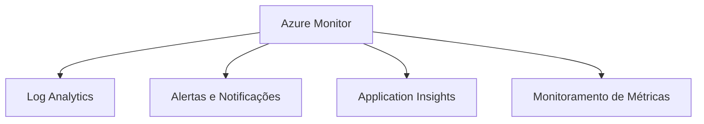

---

## 🔐 3. **Azure Policy**

O **Azure Policy** é uma ferramenta de governança que permite aplicar regras e padrões de conformidade em seus recursos do Azure. Ideal para garantir que os recursos estejam em conformidade com políticas internas ou regulatórias.

### Pontos Principais:
- **Definição de Políticas de Conformidade** 📜: Define regras que precisam ser seguidas nos recursos.
- **Aplicação Automática de Políticas** 🔄: Aplica políticas automaticamente aos recursos em diferentes estados.
- **Monitoramento de Conformidade** 📊: Gera relatórios sobre o nível de conformidade das políticas.
- **Correção Automática** ⚙️: Corrige automaticamente recursos que não estejam em conformidade com as políticas.

---

## 🏷️ 4. **Azure Cost Management and Billing**

**Azure Cost Management and Billing** ajuda a acompanhar e controlar os custos de uso dos recursos Azure, permitindo que você veja onde o orçamento está sendo aplicado e otimize gastos.

### Pontos Principais:
- **Análise de Custo e Orçamento** 💵: Gera relatórios de gastos por serviço e grupo de recursos.
- **Alertas de Gastos** 🔔: Configura alertas para não exceder o orçamento.
- **Otimização de Recursos** 🌐: Sugestões para reduzir custos em recursos subutilizados.
- **Relatórios Personalizados** 📑: Criação de relatórios detalhados para visualizar custos por período e departamento.

---

## 🛠️ 5. **Azure Automation**

**Azure Automation** é uma ferramenta para automatizar tarefas de gerenciamento e manutenção, como atualizações de sistema, execução de scripts e gerenciamento de configuração.

### Pontos Principais:
- **Runbooks** 📘: Scripts automáticos para realizar tarefas de rotina.
- **Gerenciamento de Atualizações** 🔄: Automatiza a aplicação de patches e atualizações de sistema.
- **Configuração em Escala** ⚙️: Gerenciamento de configuração de sistemas em grande escala.
- **Redução de Erros Manuais** ✅: Evita tarefas repetitivas e manuais, aumentando a eficiência.

---

## 🎓 Resumo Interativo

| Ferramenta                  | Função Principal                                | Principais Funcionalidades                          |
|-----------------------------|-------------------------------------------------|----------------------------------------------------|
| **Azure Resource Manager**  | Gerenciamento de recursos via templates         | Controle de acesso, grupos de recursos, automação  |
| **Azure Monitor**           | Monitoramento de desempenho e diagnósticos      | Insights, alertas, Log Analytics, Application Insights |
| **Azure Policy**            | Governança e conformidade                       | Definição de políticas, correção automática        |
| **Cost Management**         | Controle e otimização de gastos                 | Análise de custo, alertas de gastos, relatórios    |
| **Azure Automation**        | Automação de tarefas de manutenção              | Runbooks, gerenciamento de atualizações, configuração |

---

Essas ferramentas são essenciais para monitorar, gerenciar e otimizar o ambiente Azure, com foco em **governança, conformidade e eficiência operacional**.


# 🛡️ **Microsoft Defender for Cloud**

O **Microsoft Defender for Cloud** é uma ferramenta integrada de **gerenciamento de segurança** e **proteção contra ameaças** que ajuda a fortalecer a postura de segurança de seus recursos no Azure e em ambientes híbridos. Ele detecta, avalia e oferece orientações para corrigir vulnerabilidades de segurança e proteger dados, aplicativos e infraestrutura.

---

## 🚀 **Funcionalidades Principais**

### 1. **Gerenciamento de Postura de Segurança (CSPM)**
- **Avaliação Contínua** 🔍: Analisa os recursos do Azure e ambientes híbridos para identificar vulnerabilidades.
- **Pontos de Segurança** ⭐: Usa uma métrica chamada *Secure Score* para avaliar e melhorar a postura de segurança.
- **Recomendações de Correção** ✅: Fornece passos específicos para corrigir vulnerabilidades detectadas.

### 2. **Proteção Contra Ameaças**
- **Monitoramento em Tempo Real** 📡: Detecta atividades suspeitas ou maliciosas nos recursos.
- **Alertas de Segurança** 🚨: Gera notificações sobre ameaças em infraestrutura, redes e aplicativos.
- **Análise de Comportamento** 🧠: Identifica padrões anômalos de acesso e uso para proteger contra ataques avançados.

### 3. **Integração Multinuvem**
- **Proteção em Ambientes Híbridos** 🌐: Monitora e protege recursos locais e em outras nuvens (como AWS e Google Cloud).
- **Suporte para Kubernetes** 🐳: Ajuda a proteger clusters Kubernetes e workloads baseadas em contêineres.

### 4. **Automação e Resposta**
- **Playbooks de Resposta** ⚙️: Automatiza a resolução de problemas usando o Azure Logic Apps.
- **Análise de Incidentes** 📊: Consolida alertas e investiga causas raiz de eventos de segurança.

---

## 🔑 **Benefícios**

1. **Gestão Unificada de Segurança** 🧩: Fornece uma visão centralizada da postura de segurança em recursos locais, no Azure e em outras nuvens.
2. **Correções Proativas** 🔧: Reduz a probabilidade de incidentes com orientações práticas.
3. **Prevenção Contra Ameaças Avançadas** 🛡️: Oferece proteção adicional para cargas de trabalho críticas, como VMs, bancos de dados e contêineres.
4. **Suporte Multinuvem e Híbrido** 🌍: Protege ambientes híbridos e multinuvem sem necessidade de ferramentas adicionais.

---

## 📊 **Visão Gráfica do Funcionamento**

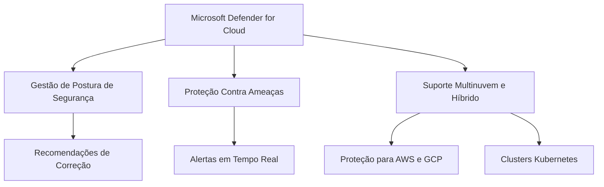

---

## 🎯 **Pontos Relevantes para o Exame AZ-900**

- **Secure Score**: Uma métrica que avalia a segurança dos recursos e sugere melhorias.
- **Gerenciamento Híbrido**: Suporte para proteger ambientes locais e outras nuvens.
- **Proteção Contra Ameaças**: Detecta comportamentos suspeitos em redes, dados e cargas de trabalho.
- **Integração com Outros Serviços do Azure**: Como o **Azure Logic Apps** para automação e o **Azure Sentinel** para monitoramento avançado.

---

O **Microsoft Defender for Cloud** é fundamental para organizações que precisam de segurança robusta e centralizada, oferecendo proteção proativa e reativa em ambientes de nuvem e híbridos.


## Segurança compartilhada 

**Responsabilidades**


# 🔒 **Autenticação Multifator (MFA) no Azure**

A **Autenticação Multifator (MFA)** é uma camada extra de segurança que exige que os usuários forneçam mais de uma forma de verificação para acessar recursos. Ela reduz significativamente os riscos de acesso não autorizado em caso de credenciais comprometidas.

---

## 🚀 **Como Funciona a MFA no Azure?**

A MFA no Azure é habilitada por meio do **Azure Active Directory (Azure AD)** e funciona combinando dois ou mais dos seguintes fatores de autenticação:

1. **Algo que você sabe**: Senha ou PIN.
2. **Algo que você possui**: Um dispositivo confiável, como um smartphone ou token físico.
3. **Algo que você é**: Biometria, como impressão digital ou reconhecimento facial.

### 🔑 Exemplos Práticos:
- Após inserir a senha, o usuário recebe um código no celular (SMS ou aplicativo de autenticação).
- Uso de biometria (Face ID ou impressão digital) como segundo fator em dispositivos móveis.

---

## 🎯 **Pontos Relevantes para o Exame AZ-900**

1. **Ativação de MFA no Azure AD**:
   - Pode ser habilitada para **usuários específicos** ou por meio de **políticas de segurança condicional**.
   - Está incluída no **Azure AD Free**, mas com recursos avançados em **Premium P1/P2**.

2. **Formas de Verificação Compatíveis**:
   - Aplicativo Microsoft Authenticator 📱.
   - SMS 📩.
   - Chamada telefônica ☎️.
   - Chave de segurança baseada em FIDO2 🔑.

3. **Segurança Condicional**:
   - MFA pode ser configurada para ser exigida apenas em situações específicas, como:
     - Acessos de dispositivos não confiáveis.
     - Acesso fora de um IP ou localidade segura.

4. **Benefícios**:
   - Redução de riscos com **acesso não autorizado**.
   - **Conformidade com regulamentações**, como LGPD, GDPR e PCI-DSS.
   - Integração com diversos serviços do Azure e aplicativos externos.

---

## 📊 **Funcionamento da MFA no Azure AD**

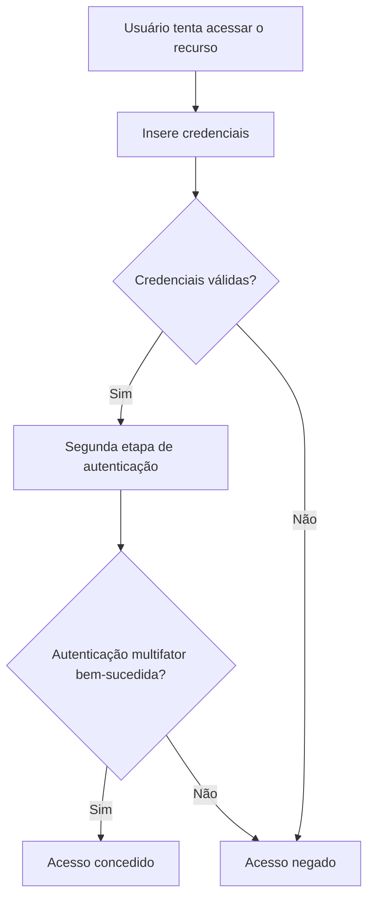

---

## 🔧 **Configuração Rápida de MFA no Azure**

1. **Acessar o Azure Portal**:
   - Navegue até **Azure Active Directory** > **Security** > **MFA**.

2. **Configurar Métodos de Verificação**:
   - Escolha entre SMS, aplicativo ou biometria.

3. **Políticas de Segurança Condicional (Opcional)**:
   - Configure regras específicas para quando exigir MFA (como logins externos).

---

## 📘 **Resumo**

| **Recurso**        | **Descrição**                                                                 |
|---------------------|-----------------------------------------------------------------------------|
| **Formas de Verificação** | SMS, aplicativo, chamada telefônica, biometria.                         |
| **Benefícios**       | Maior segurança, conformidade e integração com diversos serviços.           |
| **Políticas de Segurança**| Personaliza quando e como a MFA será exigida, com base em cenários específicos. |

A **MFA** é essencial para proteger ambientes corporativos e cumprir requisitos de segurança modernos. Ela é amplamente utilizada e frequentemente aparece como tema no exame **AZ-900**!


# 📂 **Azure Active Directory (Azure AD)**

O **Azure Active Directory (Azure AD)** é um serviço de gerenciamento de identidade e acesso baseado na nuvem que ajuda organizações a proteger e gerenciar usuários, aplicativos e dispositivos.

---

## 🎯 **Conceitos Fundamentais**

1. **Gerenciamento de Identidades** 👤:
   - Fornece uma identidade única para cada usuário acessar recursos internos e externos (ex.: aplicativos SaaS como Microsoft 365, Salesforce).

2. **Gerenciamento de Acessos** 🔐:
   - Define e aplica políticas de acesso para usuários, grupos e dispositivos.

3. **Integração com Aplicativos** 🌐:
   - Suporta logon único (SSO) para centenas de aplicativos SaaS e on-premises.

---

## 🚀 **Principais Recursos**

### 1. **Autenticação**
- **Logon Único (SSO)** 🌟: Usuários fazem login uma vez e acessam múltiplos aplicativos sem precisar inserir credenciais repetidamente.
- **Suporte a MFA** 🔒: Adiciona uma camada extra de segurança com autenticação multifator.

### 2. **Gerenciamento de Usuários e Grupos**
- **Usuários**: Adiciona usuários manuais ou sincronizados de diretórios locais (ex.: Active Directory on-premises).
- **Grupos**: Agrupa usuários para gerenciamento simplificado de permissões e acessos.

### 3. **Segurança Condicional**
- Regras dinâmicas baseadas em:
  - Localização 🌍.
  - Tipo de dispositivo 📱.
  - Sensibilidade do aplicativo 🔐.

### 4. **Identidades Externas**
- Permite que convidados (B2B) e clientes (B2C) usem identidades existentes para acessar recursos.

### 5. **Gerenciamento de Dispositivos**
- Integração com serviços como **Microsoft Intune** para gerenciar dispositivos corporativos e pessoais.

---

## 📊 **Visão Gráfica do Azure AD**

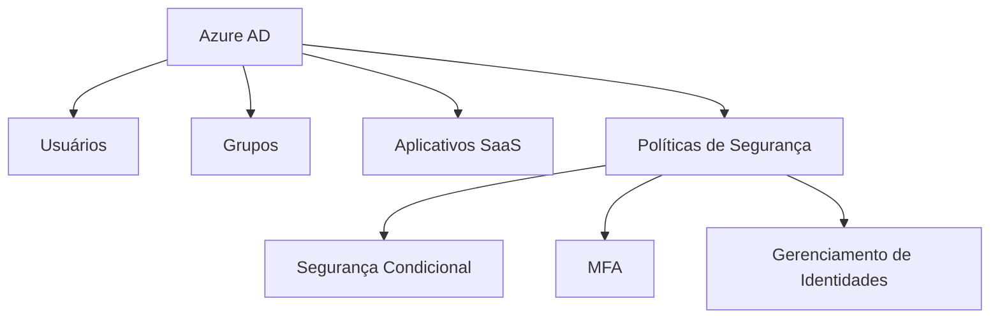

---

## 🔑 **Pontos Relevantes para o Exame AZ-900**

1. **Azure AD não é um domínio do Windows Server**:
   - Azure AD é focado em identidade na nuvem; para integração local, utiliza-se o **Azure AD Connect**.

2. **Cenários de Uso**:
   - Acessar aplicativos corporativos.
   - Gerenciar identidades de funcionários, convidados e dispositivos.
   - Implementar MFA e políticas de segurança.

3. **Licenciamento**:
   - Incluído em **Microsoft 365** e outras assinaturas.
   - **Premium P1 e P2** adicionam recursos avançados (como segurança condicional e Identity Protection).

---

## 📘 **Resumo**

| **Recurso**               | **Descrição**                                                                                |
|---------------------------|--------------------------------------------------------------------------------------------|
| **SSO**                   | Permite acessar múltiplos aplicativos com um único login.                                  |
| **MFA**                   | Adiciona segurança com autenticação multifator.                                           |
| **Segurança Condicional** | Define políticas dinâmicas para acesso baseado em risco.                                   |
| **Integração**            | Conecta-se a aplicativos SaaS, infraestrutura local e dispositivos.                        |
| **Identidades Externas**  | Gerencia acessos de parceiros, clientes e convidados.                                      |

O **Azure AD** é uma base para o gerenciamento seguro de identidades e acessos no Azure e integra-se perfeitamente com os demais serviços da Microsoft.


# 🔐 **Acesso Condicional no Azure Active Directory**

O **Acesso Condicional** é uma ferramenta poderosa no **Azure Active Directory (Azure AD)** para proteger recursos, aplicando políticas com base em condições específicas, como localização, dispositivo, ou comportamento do usuário. Ele equilibra segurança e usabilidade ao controlar quem pode acessar o quê, como e de onde.

---

## 🚀 **Como Funciona?**

O acesso condicional avalia *sinais* antes de permitir ou negar acesso. Esses sinais incluem:

1. **Quem está tentando acessar?** 👤  
   - Usuário ou grupo.
2. **O que estão tentando acessar?** 🌐  
   - Aplicativo ou recurso específico.
3. **De onde estão acessando?** 📍  
   - Localização geográfica ou rede.
4. **Em qual dispositivo estão?** 📱  
   - Tipo, status de conformidade, ou sistema operacional.
5. **Nível de risco detectado** 🛑  
   - Avaliação de comportamentos incomuns ou suspeitos.

---

## 🎯 **Elementos de uma Política de Acesso Condicional**

1. **Sinais de Entrada** (Triggers):
   - Usuários ou grupos específicos.
   - Aplicativos ou serviços.
   - Localizações ou redes específicas.
   - Estado do dispositivo.

2. **Decisões de Controle** (Actions):
   - Permitir ou bloquear acesso.
   - Exigir autenticação multifator (MFA).
   - Exigir dispositivos conformes.
   - Exigir login somente em redes seguras.

3. **Ações de Sessão**:
   - Limitar o acesso a dados sensíveis (ex.: bloqueio de download no Microsoft 365).

---

## 🛠️ **Configurações Comuns**

1. **Exigir MFA para locais não confiáveis**:
   - Garante que logins de locais desconhecidos usem autenticação multifator.

2. **Permitir acesso apenas em dispositivos conformes**:
   - Dispositivos gerenciados pelo **Microsoft Intune**.

3. **Bloquear acesso de países de alto risco**:
   - Reforça a segurança com base em localização.

---

## 📊 **Exemplo de Fluxo de Trabalho**

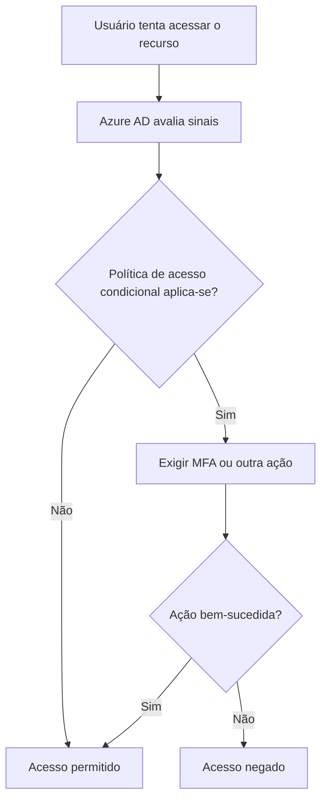

---

## 🔑 **Benefícios do Acesso Condicional**

1. **Maior Segurança** 🔒:
   - Protege contra acessos não autorizados com base em cenários dinâmicos.

2. **Flexibilidade Operacional** 🤝:
   - Adapta-se a diferentes necessidades organizacionais, equilibrando segurança e produtividade.

3. **Conformidade** ✅:
   - Ajuda a atender regulamentações de segurança (ex.: GDPR, LGPD).

4. **Integração Total** 🌐:
   - Funciona com outros serviços Microsoft e pode proteger aplicativos SaaS.

---

## 📘 **Resumo**

| **Funcionalidade**             | **Descrição**                                                                 |
|---------------------------------|-------------------------------------------------------------------------------|
| **Sinais Avaliados**            | Usuário, localização, dispositivo, aplicativo e risco.                       |
| **Decisões Possíveis**          | Permitir acesso, bloquear ou exigir MFA/dispositivo conforme.                |
| **Benefícios**                  | Segurança, flexibilidade e conformidade.                                     |
| **Exemplo de Uso**              | Bloquear logins suspeitos ou exigir MFA para recursos críticos.              |

---

## ✨ **Dica para o Exame AZ-900**

- A **segurança condicional** é baseada em políticas dinâmicas e é amplamente usada para gerenciar acessos em cenários híbridos e multinuvem. Fique atento ao seu papel em aumentar a segurança sem comprometer a experiência do usuário!

- 


# 📜 **Azure Policy**

O **Azure Policy** é uma ferramenta de governança que ajuda a garantir que os recursos na sua assinatura do Azure estejam em conformidade com regras e padrões corporativos. Ele funciona definindo **políticas** que avaliam e impõem configurações em recursos novos ou existentes.

---

## 🎯 **Objetivo**

O objetivo do Azure Policy é implementar **governança organizacional** por meio da:

- **Prevenção** de não conformidades (ex.: impedir criação de recursos fora de uma região específica).  
- **Correção automática** de desvios (ex.: aplicar tags ausentes em recursos).  
- **Monitoramento contínuo** para identificar configurações inadequadas.

---

## 🛠️ **Recursos Principais**

1. **Definição de Políticas**:
   - Regras individuais que especificam condições para avaliar recursos.
   - Exemplo: "Permitir apenas VMs de uma família de tamanhos específica".

2. **Atribuição de Políticas**:
   - Políticas podem ser atribuídas a:
     - Escopo de **assinatura**.
     - Escopo de **grupo de recursos**.
     - Escopo individual de **recurso**.

3. **Iniciativas (Policy Sets)**:
   - Conjuntos de políticas agrupadas para atender a um objetivo específico.
   - Exemplo: "Conformidade com a ISO 27001".

4. **Correção Automática**:
   - Azure Policy pode corrigir recursos automaticamente usando **modos de efeito** como *"Modify"*.

5. **Conformidade em Tempo Real**:
   - Monitora continuamente os recursos para verificar conformidade e gerar relatórios.

---

## 🚀 **Modos de Efeito**

Os efeitos das políticas definem como a regra será aplicada:

| **Efeito**    | **Descrição**                                                                 |
|---------------|-------------------------------------------------------------------------------|
| **Deny**      | Impede a criação ou alteração de recursos que não atendem à política.         |
| **Audit**     | Detecta violações, mas não impede a criação ou modificação de recursos.       |
| **Modify**    | Altera automaticamente configurações para atender à política.                |
| **Append**    | Adiciona propriedades ao recurso sem bloquear sua criação.                   |
| **DeployIfNotExists** | Implementa configurações ausentes quando o recurso não as possui.     |

---

## 📊 **Exemplo de Fluxo**

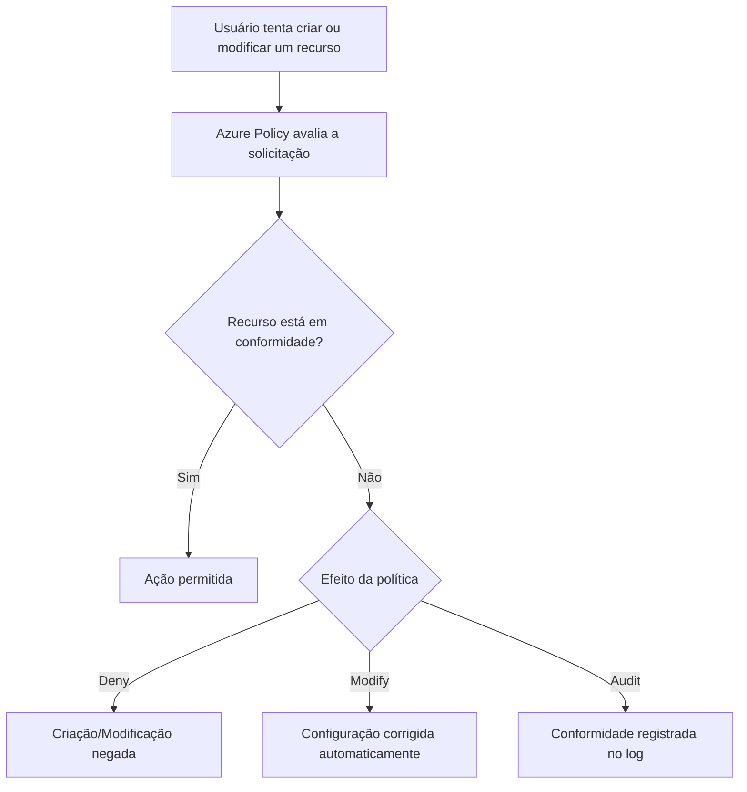

---

## ✨ **Exemplo de Uso**

### Política para Restringir Regiões Permitidas
```json
{
  "policyRule": {
    "if": {
      "field": "location",
      "notIn": ["eastus", "westeurope"]
    },
    "then": {
      "effect": "Deny"
    }
  }
}
```

### Política para Aplicar Tags Automaticamente
```json
{
  "policyRule": {
    "if": {
      "field": "tags['Environment']",
      "equals": null
    },
    "then": {
      "effect": "Modify",
      "details": {
        "roleDefinitionIds": ["/providers/Microsoft.Authorization/roleDefinitions/..."],
        "operations": [
          {
            "operation": "add",
            "field": "tags['Environment']",
            "value": "Production"
          }
        ]
      }
    }
  }
}
```

---

## 🔑 **Benefícios do Azure Policy**

1. **Governança Centralizada**:
   - Controle total sobre recursos em várias assinaturas e grupos de recursos.

2. **Conformidade Automática**:
   - Políticas podem corrigir automaticamente configurações fora do padrão.

3. **Monitoramento Contínuo**:
   - Relatórios detalhados para auditorias e conformidade regulamentar.

4. **Escalabilidade**:
   - Iniciativas permitem aplicar múltiplas políticas de uma só vez.

---

## 📘 **Resumo**

| **Recurso**               | **Descrição**                                                                 |
|---------------------------|-------------------------------------------------------------------------------|
| **Definições de Políticas** | Regras individuais que avaliam e aplicam condições em recursos.              |
| **Iniciativas**           | Grupos de políticas com um objetivo comum.                                   |
| **Modos de Efeito**       | `Deny`, `Audit`, `Modify`, `Append`, `DeployIfNotExists`.                     |
| **Benefícios**            | Maior governança, conformidade e segurança no gerenciamento de recursos.      |

---

## 💡 **Dica para o Exame AZ-900**

- **Azure Policy** é frequentemente mencionado em questões sobre **governança e conformidade**.
- Lembre-se: ele *não substitui* o controle de acesso baseado em função (**RBAC**); ao invés disso, complementa para impor regras e políticas.

# 🔑 **Controle de Acesso Baseado em Função (RBAC)**

O **RBAC (Role-Based Access Control)** é um modelo de gerenciamento de acesso no Azure que define permissões baseadas em **funções** atribuídas a usuários, grupos, ou identidades de serviço. Ele ajuda a garantir que os usuários tenham apenas os privilégios necessários para executar suas tarefas.

---

## 🎯 **Principais Características**

1. **Atribuição de Funções**:  
   - Permite atribuir permissões com base em papéis predefinidos ou personalizados.
   
2. **Princípio do Menor Privilégio**:  
   - Usuários recebem apenas as permissões mínimas necessárias para realizar suas tarefas.

3. **Níveis de Escopo**:  
   - Permissões podem ser atribuídas em diferentes níveis:
     - **Assinatura** 🌐.
     - **Grupo de Recursos** 📂.
     - **Recurso Específico** 🛠️.

4. **Integração com Azure AD**:  
   - Usa identidades do **Azure Active Directory** para gerenciar acessos.

---

## 🛠️ **Componentes Principais**

### 1. **Princípios de Segurança (Identidades)**  
- Quem recebe as permissões:  
  - Usuários.  
  - Grupos.  
  - Identidades gerenciadas.  

### 2. **Funções (Roles)**  
- Define as permissões atribuídas aos princípios de segurança.  
- Exemplos de funções predefinidas:
  - **Owner**: Acesso total, incluindo atribuição de permissões.
  - **Contributor**: Gerencia recursos, mas não atribui permissões.
  - **Reader**: Somente leitura.

### 3. **Escopo (Scope)**  
- Onde as permissões se aplicam:
  - Assinatura.  
  - Grupo de recursos.  
  - Recurso individual.

---

## 🔐 **Como o RBAC Funciona?**

1. Um administrador atribui uma **função** a um **usuário** em um determinado **escopo**.  
2. O Azure verifica se o usuário tem as permissões necessárias com base na função atribuída.  
3. O acesso é concedido ou negado.

---

## 📊 **Exemplo de Fluxo de Autorização**

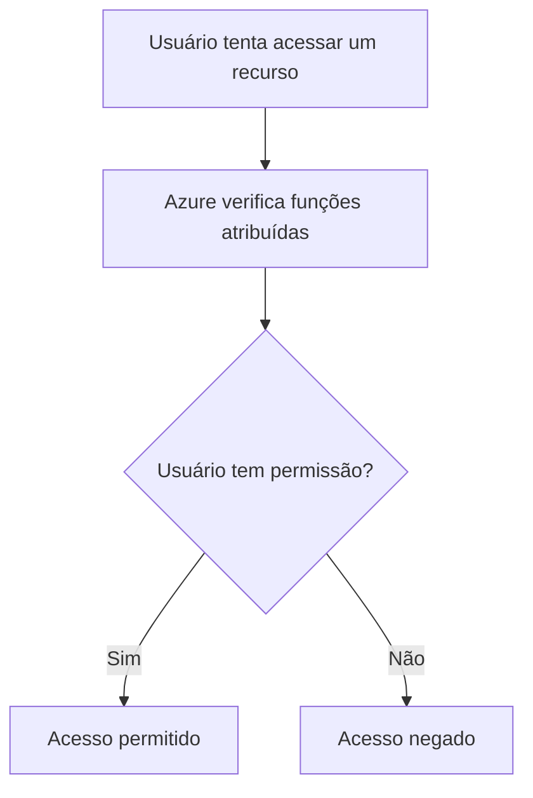

---

## ✨ **Exemplo de Atribuição**

- **Cenário**:  
  Um desenvolvedor precisa criar e gerenciar máquinas virtuais, mas não deve alterar permissões de acesso.

| **Componente**         | **Configuração**               |
|-------------------------|--------------------------------|
| **Princípio de Segurança** | Usuário: *João Silva*         |
| **Função**              | *Contributor*                 |
| **Escopo**              | Grupo de recursos: *ProjetoX* |

---

## 💡 **RBAC vs Azure Policy**

| **RBAC**                               | **Azure Policy**                              |
|----------------------------------------|-----------------------------------------------|
| Foca em **quem** pode acessar.          | Foca em **o que** pode ser configurado.       |
| Gerencia permissões.                    | Garante conformidade com regras específicas. |
| Exemplo: "João pode criar VMs?"         | Exemplo: "As VMs só podem ser criadas na região Leste dos EUA." |

---

## 🔑 **Benefícios do RBAC**

1. **Segurança Refinada** 🔒:  
   - Permissões personalizadas para diferentes equipes e indivíduos.

2. **Escalabilidade** 📈:  
   - Gerenciamento de acessos em grandes organizações com facilidade.

3. **Conformidade** ✅:  
   - Controle granular para atender aos requisitos de auditoria e governança.

---

## 📘 **Resumo**

| **Recurso**               | **Descrição**                                                                 |
|---------------------------|-------------------------------------------------------------------------------|
| **RBAC**                  | Modelo que atribui permissões baseadas em funções no Azure.                  |
| **Funções Predefinidas**  | Owner, Contributor, Reader, entre outras.                                    |
| **Escopo**                | Pode ser aplicado em nível de assinatura, grupo de recursos ou recurso.      |
| **Benefícios**            | Segurança refinada, controle granular e conformidade.                       |

---

## 📌 **Dica para o Exame AZ-900**

- **RBAC** é fundamental para questões sobre **gerenciamento de identidade e acesso**.  
- Lembre-se: o **RBAC** controla *quem tem acesso* a um recurso e quais ações podem ser realizadas.

# 💰 **Gerenciamento de Custos e Calculadora de Preços no Azure**

O **gerenciamento de custos** e a **calculadora de preços** são ferramentas essenciais para ajudar os usuários a planejar, monitorar e otimizar os gastos no Azure. Elas permitem estimar custos antes de iniciar projetos e garantir que os gastos reais estejam alinhados ao orçamento.

---

## 🛠️ **Azure Pricing Calculator** (Calculadora de Preços)

### **O que é?**
Uma ferramenta que ajuda a estimar os custos dos serviços do Azure com base nas configurações e especificações do projeto.  
👉 [Acesse aqui a Calculadora de Preços](https://azure.microsoft.com/pricing/calculator/)

### **Principais Funcionalidades**
1. **Simulação de Custos**:
   - Adicione serviços (VMs, Banco de Dados, Armazenamento, etc.).
   - Configure parâmetros, como região, tipo de máquina e duração.
   
2. **Estimar Custos por Uso**:
   - Pague apenas pelo que usar com simulações baseadas em consumo.

3. **Exportação e Compartilhamento**:
   - Gere relatórios detalhados para compartilhar com sua equipe.

### **Exemplo de Uso**
Você quer saber o custo de executar 2 máquinas virtuais (VMs) por 30 dias:  
- Escolha "Máquinas Virtuais".  
- Selecione a região, sistema operacional e tipo de VM.  
- Veja o custo estimado mensal.

```mermaid
graph TD;
    A[Usuário acessa a calculadora] --> B[Seleciona serviços do Azure];
    B --> C[Configura requisitos];
    C --> D[Obtém custo estimado];
    D --> E[Exporta relatório para análise].
```

---

## 📊 **Azure Cost Management** (Gerenciamento de Custos)

### **O que é?**
Uma solução integrada para monitorar, alocar e otimizar os custos no Azure.

### **Principais Recursos**
1. **Análise de Custos**:  
   - Exibe gráficos e relatórios detalhados sobre o consumo.

2. **Alertas de Orçamento**:  
   - Configure limites e receba notificações ao ultrapassar um orçamento.

3. **Divisão de Custos**:  
   - Analise custos por assinatura, grupo de recursos ou serviço.

4. **Recomendações de Otimização**:  
   - Identifica recursos não utilizados ou subutilizados.

5. **Integração Multinuvem**:
   - Gerencie custos do Azure, AWS e Google Cloud em uma única interface.

### **Exemplo de Uso**
- Configure um orçamento mensal de $500.  
- Receba alertas por e-mail ao atingir 80%, 90% e 100% do orçamento.  

---

## 🧮 **Comparação Entre Ferramentas**

| **Ferramenta**                 | **Descrição**                                                                 |
|---------------------------------|-------------------------------------------------------------------------------|
| **Calculadora de Preços**       | Simula custos antes da utilização dos serviços.                              |
| **Gerenciamento de Custos**     | Monitora e otimiza gastos em serviços em uso no Azure.                       |

---

## ✨ **Benefícios**

1. **Transparência Financeira**:
   - Planejamento e controle de custos para evitar gastos inesperados.

2. **Otimização de Recursos**:
   - Reduza custos identificando e eliminando recursos ociosos.

3. **Alertas e Ações Proativas**:
   - Receba notificações antes de ultrapassar limites financeiros.

---

## 💡 **Dica para o Exame AZ-900**

- **Calculadora de Preços**: Use para estimar custos ANTES de provisionar recursos.  
- **Gerenciamento de Custos**: Usado para controlar e otimizar despesas de recursos já implementados.

> *Exemplo de questão*: "Qual ferramenta ajuda a definir alertas quando os custos excedem um orçamento planejado?"  
   - Resposta: **Gerenciamento de Custos**.


# 🔍 **Diferença entre Azure Monitor, Assistente e Integridade do Serviço**

Esses três serviços do Azure desempenham papéis diferentes, mas complementares, para ajudar a gerenciar e monitorar recursos e serviços no Azure. Entender suas funções é essencial para um gerenciamento eficaz.

---

## **1. Azure Monitor (Azure Monitor)**

### **O que é?**
Uma solução abrangente para monitoramento de desempenho e disponibilidade de recursos do Azure, aplicações e infraestrutura.

### **Principais Funções**
- **Coleta de Logs e Métricas**:
  - Armazena e analisa dados de desempenho e logs de atividade.
- **Alertas Personalizados**:
  - Notifica automaticamente sobre problemas, como aumento de latência ou uso excessivo de CPU.
- **Visualização de Dados**:
  - Painéis interativos no Azure ou no Power BI para análise de métricas e logs.
- **Integração com Serviços**:
  - Trabalha junto com Application Insights e Log Analytics.

---

## **2. Assistente do Azure (Azure Advisor)**

### **O que é?**
Uma ferramenta que fornece recomendações personalizadas para melhorar **segurança**, **desempenho**, **confiabilidade**, e **redução de custos**.

### **Principais Funções**
- **Recomendações de Otimização**:
  - Melhora a eficiência dos recursos (ex.: redimensionar máquinas virtuais subutilizadas).
- **Sugestões Proativas**:
  - Ajuda a prevenir problemas antes que eles ocorram.
- **Foco na Governança**:
  - Identifica configurações que não seguem boas práticas.

---

## **3. Integridade do Serviço do Azure (Azure Service Health)**

### **O que é?**
Um painel que exibe o status de funcionamento dos serviços do Azure em tempo real, fornecendo informações sobre interrupções ou falhas planejadas.

### **Principais Funções**
- **Status de Serviço em Tempo Real**:
  - Mostra a integridade global e regional dos serviços.
- **Notificações Personalizadas**:
  - Avisa sobre incidentes que afetam os recursos da sua assinatura.
- **Planejamento de Manutenção**:
  - Informa sobre atualizações ou eventos planejados que podem afetar o desempenho.

---

## 📊 **Comparação Resumida**

| **Recurso**               | **Azure Monitor (Azure Monitor)**          | **Assistente do Azure (Azure Advisor)**   | **Integridade do Serviço (Azure Service Health)** |
|---------------------------|-------------------------------------------|-------------------------------------------|--------------------------------------------------|
| **Objetivo**              | Monitorar recursos e coletar dados.      | Melhorar recursos com recomendações.      | Informar sobre status de serviços Azure.        |
| **Foco Principal**        | Desempenho e disponibilidade.            | Otimização, custo e governança.           | Status e interrupções de serviços.              |
| **Alertas e Notificações**| Alertas baseados em métricas e logs.     | Recomendações baseadas em análises.       | Notificações sobre incidentes.                  |
| **Visualização**          | Painéis interativos e logs detalhados.   | Lista de recomendações e insights.        | Painel de integridade no portal do Azure.       |
| **Escopo**                | Recursos do Azure e infraestrutura.      | Governança e boas práticas.               | Serviços do Azure globalmente.                  |

---

## 🎯 **Quando Usar Cada Um?**

| **Situação**                                                   | **Ferramenta**                          |
|---------------------------------------------------------------|-----------------------------------------|
| Monitorar o uso de CPU em uma máquina virtual.                | Azure Monitor (Azure Monitor)           |
| Saber se um serviço do Azure está indisponível na sua região. | Integridade do Serviço (Azure Service Health) |
| Receber sugestões para economizar custos em sua assinatura.   | Assistente do Azure (Azure Advisor)     |

---

## 💡 **Dica para o Exame AZ-900**

- **Azure Monitor (Azure Monitor)**: Ferramenta de monitoramento. Use para rastrear logs e métricas.  
- **Assistente do Azure (Azure Advisor)**: Ferramenta de recomendação para otimização de recursos.  
- **Integridade do Serviço (Azure Service Health)**: Mostra o status atual e planejado dos serviços do Azure.

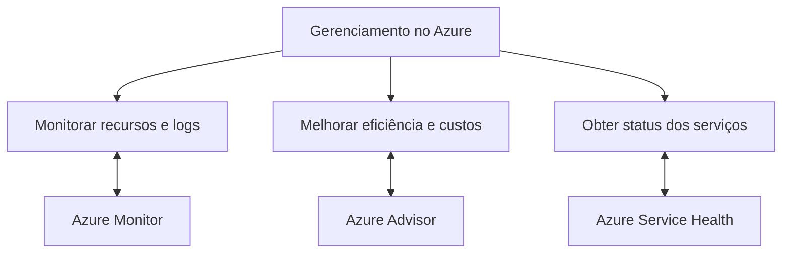


# 🔑 **Diferença entre Acesso Condicional e Controle RBAC no Azure**

Embora o **Acesso Condicional** e o **Controle Baseado em Função (RBAC)** sejam ferramentas de gerenciamento de segurança no Azure, eles têm objetivos e funcionalidades distintas. Abaixo, explicamos as diferenças e quando usar cada um.

---

## **1. Acesso Condicional (Conditional Access)**

### **O que é?**
Uma ferramenta no **Azure Active Directory (Azure AD)** que permite configurar políticas para controlar como e quando os usuários acessam aplicativos e dados, baseado em condições específicas.

### **Características Principais**
- **Baseado em Condições**:
  - Define regras baseadas em *quem* está acessando, *de onde*, *quando* e *em quais condições*.  
  - Exemplo: Requer autenticação multifator (MFA) para acessos fora da rede corporativa.
  
- **Políticas Granulares**:
  - Permite ações como: *bloquear*, *requerer MFA*, *limitar acesso* ou *permitir sem restrições*.

- **Cenários Comuns**:
  - Acesso seguro para usuários remotos.
  - Proteção contra login de locais ou dispositivos não confiáveis.
  - Controle de acesso por aplicativos ou grupos específicos.

### **Exemplo de Política**  
"Usuários acessando o Azure de fora do país precisam realizar MFA."

---

## **2. Controle Baseado em Função (Role-Based Access Control - RBAC)**

### **O que é?**
Um mecanismo para gerenciar permissões de acesso a recursos do Azure com base no princípio de **mínimo privilégio**, atribuindo funções específicas aos usuários.

### **Características Principais**
- **Baseado em Funções**:
  - Permite definir *o que* um usuário pode **ver** ou **fazer** em recursos do Azure.
  - Exemplo: Conceder ao usuário permissão para *gerenciar máquinas virtuais*, mas não acesso a bancos de dados.

- **Funções Padrão ou Personalizadas**:
  - Exemplo de funções padrão: **Leitor (Reader)**, **Contribuidor (Contributor)**, **Proprietário (Owner)**.
  - Funções personalizadas permitem configurações específicas de acesso.

- **Escopo Hierárquico**:
  - Aplica permissões em diferentes níveis: **grupo de recursos**, **recurso individual** ou **assinatura**.

### **Exemplo de Configuração**  
"Um analista pode apenas visualizar (leitura) os logs de um grupo de recursos específico."

---

## 📊 **Comparação Resumida**

| **Característica**           | **Acesso Condicional (Conditional Access)**        | **RBAC (Role-Based Access Control)**           |
|------------------------------|---------------------------------------------------|-----------------------------------------------|
| **Objetivo**                 | Controlar *como e quando* o acesso é permitido.  | Controlar *o que* pode ser acessado e feito. |
| **Base de Controle**         | Condições contextuais (local, dispositivo, MFA). | Permissões baseadas em funções.              |
| **Escopo**                   | Aplicativos, serviços de nuvem e acessos gerais. | Recursos do Azure (VMs, bancos, etc.).       |
| **Foco Principal**           | Proteção contra acessos não autorizados.         | Minimização de privilégios.                  |
| **Nível de Aplicação**       | Usuários ou grupos no Azure AD.                  | Recursos na assinatura do Azure.             |
| **Exemplo de Uso**           | Requer MFA para login fora da rede.             | Conceder acesso de leitura a um recurso.     |

---

## 🎯 **Quando Usar Cada Um?**

| **Cenário**                                                       | **Ferramenta Recomendada**         |
|-------------------------------------------------------------------|------------------------------------|
| Proteger aplicativos contra logins inseguros.                     | **Acesso Condicional (Conditional Access)** |
| Delegar permissões específicas para gerenciar máquinas virtuais.  | **RBAC (Role-Based Access Control)** |
| Bloquear usuários de países específicos para acessar recursos.    | **Acesso Condicional (Conditional Access)** |
| Permitir que apenas um grupo gerencie um banco de dados.          | **RBAC (Role-Based Access Control)** |

---

## 💡 **Dica para o Exame AZ-900**

1. **RBAC (Role-Based Access Control)**:
   - Use para gerenciar permissões específicas sobre recursos do Azure.
   - Baseia-se no conceito de *funções atribuídas*.  

2. **Acesso Condicional (Conditional Access)**:
   - Use para aplicar políticas baseadas em condições contextuais, como localização, dispositivos ou autenticação MFA.  

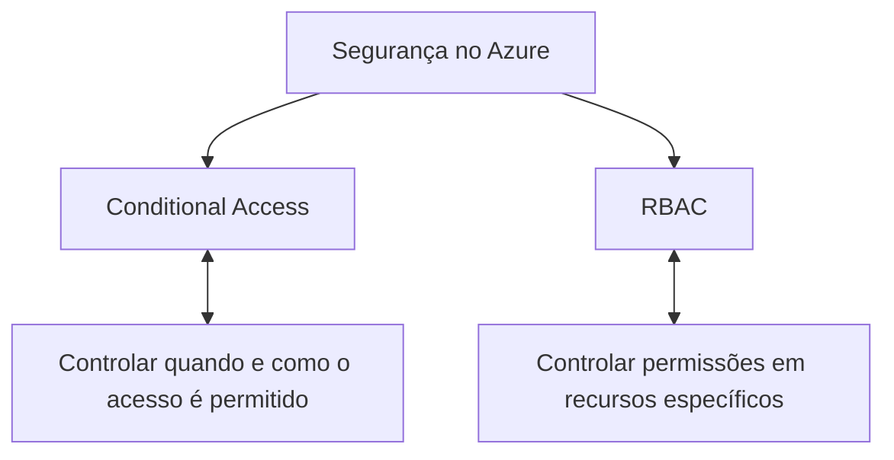
