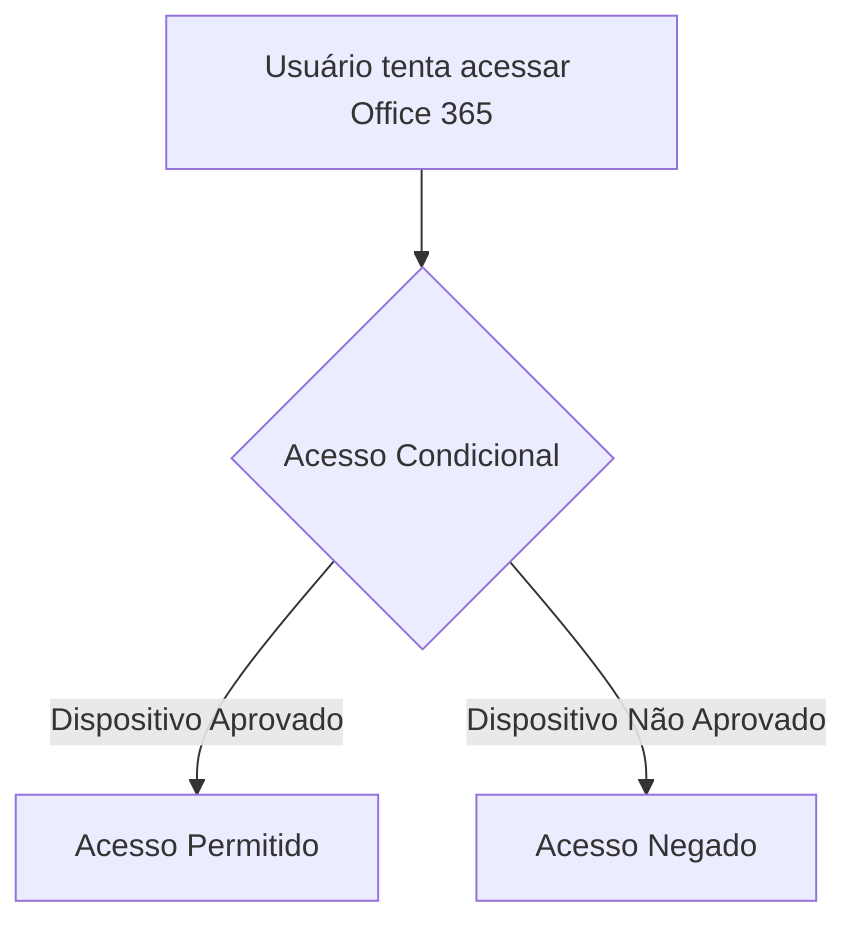
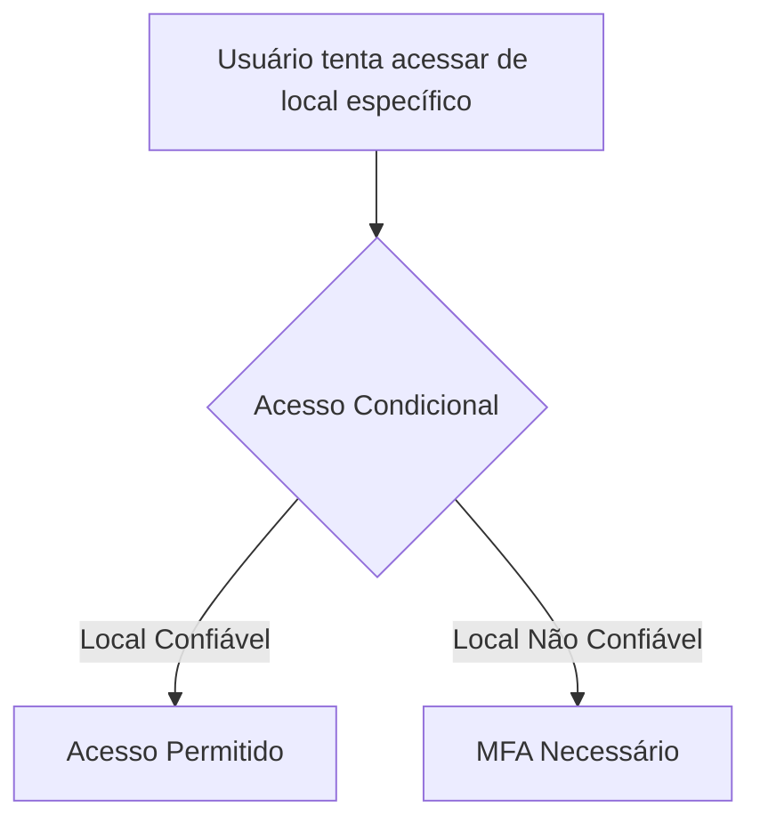
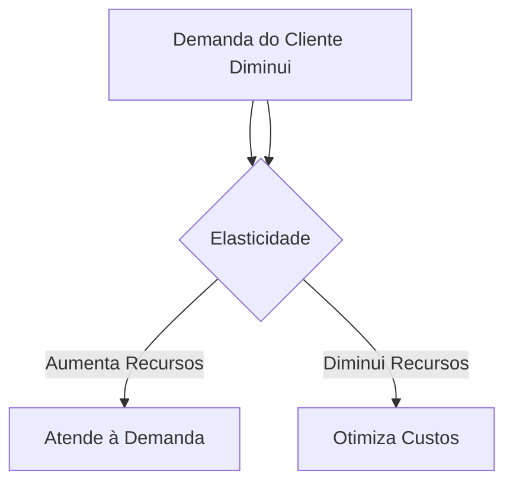
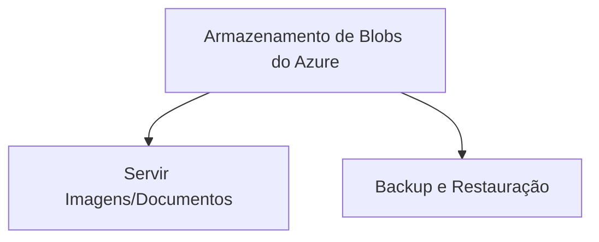
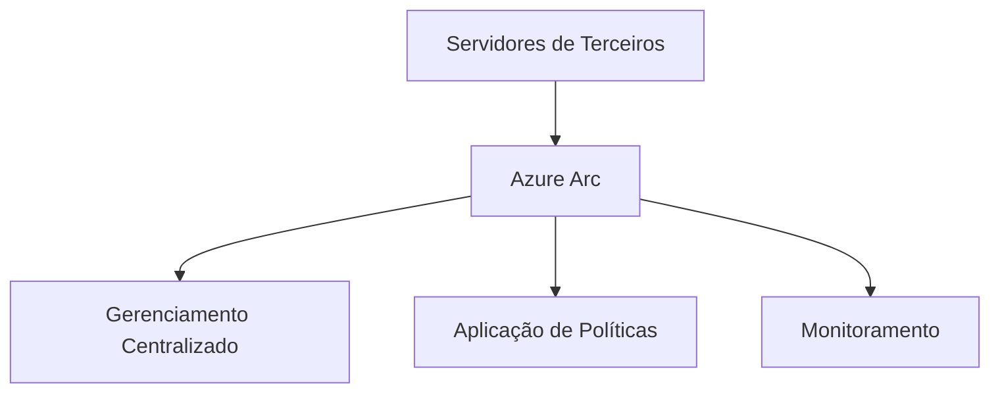

# Guia de Estudo para AZ-900: Armazenamento de Blobs do Azure

## 📚 Pergunta: Qual camada de armazenamento de Blobs do Azure armazena dados offline e oferece os menores custos de armazenamento e os maiores custos para acessar dados?

### 📝 Resposta:
A **Camada de Arquivo** (Archive Tier) é a camada de armazenamento de Blobs do Azure que armazena dados offline. Esta camada oferece os menores custos de armazenamento, mas os maiores custos para acessar os dados.

### 📊 Detalhes:
- **Camada de Arquivo (Archive Tier)**:
  - **Custo de Armazenamento**: Muito baixo
  - **Custo de Acesso**: Alto
  - **Latência de Acesso**: Alta (pode levar horas para reidratar os dados)
  - **Uso Ideal**: Dados raramente acessados, como backups de longo prazo e dados de conformidade¹(https://learn.microsoft.com/pt-br/azure/storage/blobs/access-tiers-overview)²(https://learn.microsoft.com/pt-pt/azure/storage/blobs/access-tiers-overview).

### 📈 Comparação das Camadas de Acesso:
| Camada          | Custo de Armazenamento | Custo de Acesso | Latência de Acesso | Uso Ideal                          |
|-----------------|------------------------|-----------------|--------------------|------------------------------------|
| **Quente**      | Alto                   | Baixo           | Baixa              | Dados acessados frequentemente     |
| **Fria**        | Médio                  | Médio           | Média              | Dados acessados esporadicamente    |
| **Arquivo**     | Baixo                  | Alto            | Alta               | Dados raramente acessados          |

### 📌 Nota:
- **Reidratação**: Para acessar dados na camada de arquivo, é necessário reidratá-los para uma camada online (Quente ou Fria), o que pode levar até 15 horas¹(https://learn.microsoft.com/pt-br/azure/storage/blobs/access-tiers-overview).

¹(https://learn.microsoft.com/pt-br/azure/storage/blobs/access-tiers-overview): [Camadas de acesso para dados de blob - Azure Storage](https://learn.microsoft.com/pt-br/azure/storage/blobs/access-tiers-overview)
²(https://learn.microsoft.com/pt-pt/azure/storage/blobs/access-tiers-overview): [Melhores práticas para usar camadas de acesso de blob - Azure Storage](https://learn.microsoft.com/pt-br/azure/storage/blobs/access-tiers-best-practices)

Fonte: conversa com o Copilot, 11/11/2024
(1) Camadas de acesso para dados de blob - Azure Storage. https://learn.microsoft.com/pt-br/azure/storage/blobs/access-tiers-overview.
(2) Camadas de acesso para dados de blobs - Azure Storage. https://learn.microsoft.com/pt-pt/azure/storage/blobs/access-tiers-overview.

# Guia de Estudo para AZ-900: Estratégias de Segurança

## 📚 Pergunta: Qual tipo de estratégia usa uma série de mecanismos para retardar o avanço de um ataque que visa obter acesso não autorizado aos dados?

### 📝 Resposta:
**Defesa em Profundidade** é a estratégia correta. Esta abordagem utiliza uma série de mecanismos e controles em camadas para atrasar e dificultar o avanço de um ataque, protegendo a confidencialidade, integridade e disponibilidade dos dados¹(https://microhard.com.br/defesa-em-profundidade-o-que-e-e-como-implementar-essa-estrategia-de-ciberseguranca/).

### 📊 Comparação das Estratégias:
| Estratégia                      | Descrição                                                                 |
|---------------------------------|---------------------------------------------------------------------------|
| **Defesa em Profundidade**      | Uso de múltiplas camadas de segurança para proteger dados e sistemas.     |
| **DDoS (Negaçao de Serviço)**   | Ataques que visam sobrecarregar sistemas para torná-los indisponíveis.    |
| **Acesso com Privilégios Mínimos** | Concessão de permissões mínimas necessárias para realizar tarefas.       |
| **Perímetro**                   | Foco na proteção das fronteiras da rede, como firewalls e gateways.       |

### 📌 Nota:
- **Defesa em Profundidade**: Implementa várias camadas de segurança, como firewalls, sistemas de detecção de intrusão, autenticação multifator, entre outros, para criar uma defesa robusta contra ataques¹(https://microhard.com.br/defesa-em-profundidade-o-que-e-e-como-implementar-essa-estrategia-de-ciberseguranca/).
- 
¹(https://microhard.com.br/defesa-em-profundidade-o-que-e-e-como-implementar-essa-estrategia-de-ciberseguranca/): [Defesa em profundidade: o que é e como implementar essa estratégia de cibersegurança](https://microhard.com.br/defesa-em-profundidade-o-que-e-e-como-implementar-essa-estrategia-de-ciberseguranca/)

Fonte: conversa com o Copilot, 11/11/2024
(1) Defesa em profundidade: o que é e como implementar essa estratégia de .... https://microhard.com.br/defesa-em-profundidade-o-que-e-e-como-implementar-essa-estrategia-de-ciberseguranca/.

# Guia de Estudo para AZ-900: Autenticação e Segurança

## 📚 Pergunta: O que você pode usar para garantir que os usuários se autentiquem usando autenticação multifator (MFA) ao tentarem entrar de um local específico?

### 📝 Resposta:
**Acesso Condicional** é a resposta correta. O Acesso Condicional permite definir políticas que exigem autenticação multifator (MFA) com base em condições específicas, como a localização do usuário.

### 📊 Comparação das Opções:
| Opção                                | Descrição                                                                 |
|--------------------------------------|---------------------------------------------------------------------------|
| **Unidades Administrativas**         | Estruturas organizacionais para gerenciar recursos do Azure.              |
| **RBAC (Controle de Acesso Baseado em Função)** | Gerencia permissões de acesso a recursos do Azure com base em funções.    |
| **Acesso Condicional**               | Define políticas de acesso que podem exigir MFA com base em condições específicas. |
| **SSO (Logon Único)**                | Permite que os usuários acessem vários aplicativos com uma única autenticação. |

### 📌 Nota:
- **Acesso Condicional**: É uma ferramenta poderosa no Azure AD que permite aplicar políticas de segurança baseadas em condições como localização, dispositivo, risco de login, entre outros.

: Acesso Condicional no Azure Active Directory

# Guia de Estudo para AZ-900: Marcas de Recurso

## 📚 Pergunta: Quais são dois cenários comuns para usar marcas de recurso? Cada resposta correta apresenta uma solução completa.

### 📝 Resposta:
1. **Associar custos com ambientes diferentes**: Esta prática permite que você identifique e atribua custos a diferentes ambientes, como desenvolvimento, teste e produção, facilitando a gestão financeira e a otimização de recursos.
   
2. **Categorizar custos por departamento**: Utilizar marcas de recurso para categorizar custos por departamento ajuda a entender e controlar os gastos de cada unidade organizacional, promovendo uma melhor alocação de orçamento e recursos.

### 📊 Comparação das Opções:
| Opção                                    | Descrição                                                                 |
|------------------------------------------|---------------------------------------------------------------------------|
| **Associar custos com ambientes diferentes** | Correto. Facilita a gestão financeira entre diferentes ambientes.         |
| **Categorizar custos por departamento**  | Correto. Ajuda na alocação de orçamento e controle de gastos por departamento. |
| **Identificar regiões de custo mais baixo** | Incorreto. Marcas de recurso não são usadas para identificar regiões de custo mais baixo. |
| **Redimensionar máquinas virtuais subutilizadas** | Incorreto. Marcas de recurso não são usadas diretamente para redimensionar máquinas virtuais. |

### 📌 Nota:
- **Marcas de Recurso**: São rótulos aplicados a recursos do Azure que consistem em pares chave-valor, permitindo a categorização e organização de recursos para fins de gerenciamento e relatórios.

: Marcas de recurso no Azure

# Guia de Estudo para AZ-900: Gerenciamento de Custos do Azure + Cobrança

## 📚 Pergunta: Quais são os dois recursos disponíveis usando o Gerenciamento de Custos do Azure + Cobrança? Cada resposta correta apresenta uma solução completa.

### 📝 Resposta:
1. **Crie e gerencie orçamentos**: Este recurso permite que você defina orçamentos para monitorar e controlar os gastos no Azure. Você pode criar alertas que notificam automaticamente quando os gastos se aproximam ou excedem o orçamento definido¹(https://learn.microsoft.com/pt-br/azure/cost-management-billing/understand/plan-manage-costs).

2. **Gere relatórios históricos e preveja o uso futuro**: Com este recurso, você pode analisar os custos passados e prever o uso futuro, ajudando a otimizar e planejar os gastos de forma mais eficiente¹(https://learn.microsoft.com/pt-br/azure/cost-management-billing/understand/plan-manage-costs).

### 📊 Comparação das Opções:
| Opção                                            | Descrição                                                                 |
|--------------------------------------------------|---------------------------------------------------------------------------|
| **Crie e gerencie orçamentos**                   | Correto. Permite definir orçamentos e criar alertas para monitorar gastos.|
| **Estime o custo total de propriedade antes que os recursos sejam implantados** | Incorreto. Este recurso é oferecido pela Calculadora de Preços do Azure.  |
| **Gere relatórios históricos e preveja o uso futuro** | Correto. Permite analisar custos passados e prever uso futuro.            |
| **Forneça preços com desconto quando você pagar antecipadamente** | Incorreto. Este recurso está relacionado a planos de economia e reservas. |

### 📌 Nota:
- **Gerenciamento de Custos do Azure + Cobrança**: É uma ferramenta essencial para monitorar, analisar e otimizar os custos no Azure, ajudando a garantir que os recursos sejam utilizados de forma eficiente e econômica¹(https://learn.microsoft.com/pt-br/azure/cost-management-billing/understand/plan-manage-costs).

¹(https://learn.microsoft.com/pt-br/azure/cost-management-billing/understand/plan-manage-costs): [Gerenciamento de Custos + Cobrança no Azure](https://learn.microsoft.com/pt-br/azure/cost-management-billing/)

Fonte: conversa com o Copilot, 11/11/2024
(1) Planejar o gerenciamento de custos do Azure - Microsoft Cost Management. https://learn.microsoft.com/pt-br/azure/cost-management-billing/understand/plan-manage-costs.

# Guia de Estudo para AZ-900: Portal do Azure

## 📚 Pergunta: Quais são as duas ações que podem ser executadas usando o portal do Azure? Cada resposta correta apresenta uma solução completa.

### 📝 Resposta:
1. **Crie novos recursos**: Esta ação é correta. O portal do Azure permite que você crie e gerencie uma ampla variedade de recursos, como máquinas virtuais, bancos de dados, redes virtuais, entre outros¹(https://azure.microsoft.com/pt-br/get-started/welcome-to-azure/).

2. **Criar usuário do Microsoft Entra**: Esta ação também é correta. Você pode usar o portal do Azure para criar e gerenciar usuários no Microsoft Entra ID (anteriormente conhecido como Azure Active Directory)¹(https://azure.microsoft.com/pt-br/get-started/welcome-to-azure/).

### 📊 Comparação das Opções:
| Opção                                      | Descrição                                                                 |
|--------------------------------------------|---------------------------------------------------------------------------|
| **Altere a zona de disponibilidade de uma máquina virtual** | Incorreto. Alterar a zona de disponibilidade de uma VM existente não é uma ação suportada diretamente pelo portal do Azure. |
| **Crie novos recursos**                    | Correto. Permite criar e gerenciar recursos no Azure.                     |
| **Atribuir permissão de negação em um grupo de recursos** | Incorreto. O portal do Azure não permite atribuir permissões de negação diretamente. |
| **Criar usuário do Microsoft Entra**       | Correto. Permite criar e gerenciar usuários no Microsoft Entra ID.        |

### 📌 Nota:
- **Portal do Azure**: É uma interface web que permite gerenciar e monitorar todos os serviços do Azure. Ele oferece uma experiência unificada para criar, configurar e gerenciar recursos do Azure¹(https://azure.microsoft.com/pt-br/get-started/welcome-to-azure/).

¹(https://azure.microsoft.com/pt-br/get-started/welcome-to-azure/): [Bem-vindo(a) ao Azure – Introdução | Microsoft Azure](https://azure.microsoft.com/pt-br/get-started/welcome-to-azure/)

Fonte: conversa com o Copilot, 11/11/2024
(1) Bem-vindo(a) ao Azure – Introdução | Microsoft Azure. https://azure.microsoft.com/pt-br/get-started/welcome-to-azure/.

# Guia de Estudo para AZ-900: Continuidade dos Negócios no Azure

## 📚 Pergunta: Qual componente do Azure permite replicar recursos em uma área geográfica para garantir a continuidade dos negócios durante um desastre natural no local primário?

### 📝 Resposta:
**Pares de Região** é a resposta correta. Este componente do Azure permite replicar recursos em uma área geográfica diferente para garantir a continuidade dos negócios em caso de desastres naturais ou falhas no local primário.

### 📊 Comparação das Opções:
| Opção                                            | Descrição                                                                 |
|--------------------------------------------------|---------------------------------------------------------------------------|
| **Conjuntos de Disponibilidade**                 | Agrupam máquinas virtuais dentro de um datacenter para alta disponibilidade. |
| **Zonas de Disponibilidade**                     | Oferecem redundância dentro da mesma região, mas não em diferentes áreas geográficas. |
| **Conjuntos de Dimensionamento de Máquina Virtual do Azure** | Gerenciam automaticamente o dimensionamento de um conjunto de VMs.        |
| **Pares de Região**                              | Correto. Replicam recursos em diferentes regiões geográficas para continuidade dos negócios. |

### 📌 Nota:
- **Pares de Região**: Cada região do Azure é emparelhada com outra região dentro da mesma geografia, garantindo que os dados sejam replicados e que os serviços possam ser restaurados rapidamente em caso de falha ou desastre.

Espero que isso ajude no seu estudo! Se tiver mais perguntas, estou aqui para ajudar. Boa sorte na sua prova! 🎓🚀

: Pares de Região no Azure

# Guia de Estudo para AZ-900: Computação Sem Servidor

## 📚 Pergunta: O que você pode usar para executar código em um ambiente sem servidor?

### 📝 Resposta:
**Funções do Azure** é a resposta correta. Este serviço permite que você execute código em um ambiente sem servidor, onde a infraestrutura é gerenciada automaticamente pelo Azure.

### 📊 Comparação das Opções:
| Opção                                      | Descrição                                                                 |
|--------------------------------------------|---------------------------------------------------------------------------|
| **Instâncias de Contêiner do Azure**       | Permitem executar contêineres sem gerenciar VMs, mas não são sem servidor.|
| **Funções do Azure**                       | Correto. Executam código em um ambiente sem servidor.                     |
| **Aplicativos Lógicos do Azure**           | Automatizam fluxos de trabalho e integração de aplicativos, mas não são especificamente para execução de código sem servidor. |
| **Área de Trabalho Virtual do Azure**      | Serviço de virtualização de desktops, não relacionado a execução de código sem servidor. |

### 📌 Nota:
- **Funções do Azure**: São ideais para cenários como processamento de eventos, automação de tarefas e integração de sistemas, onde você paga apenas pelo tempo de execução do código.

Espero que isso ajude no seu estudo! Se tiver mais perguntas, estou aqui para ajudar. Boa sorte na sua prova! 🎓🚀

: Funções do Azure

# Guia de Estudo para AZ-900: Execução de Aplicativos em Contêineres

## 📚 Pergunta: Quais são dois serviços que permitem executar aplicativos em contêineres? Cada resposta correta apresenta uma solução completa.

### 📝 Resposta:
1. **Instâncias de Contêiner do Azure**: Correto. Este serviço permite que você execute contêineres de forma rápida e fácil, sem a necessidade de gerenciar máquinas virtuais ou infraestrutura subjacente.

2. **AKS (Serviço de Kubernetes do Azure)**: Correto. O AKS é um serviço gerenciado de Kubernetes que facilita a implantação, gerenciamento e operação de clusters de contêineres Kubernetes no Azure.

### 📊 Comparação das Opções:
| Opção                                      | Descrição                                                                 |
|--------------------------------------------|---------------------------------------------------------------------------|
| **Instâncias de Contêiner do Azure**       | Correto. Executa contêineres sem gerenciar infraestrutura.                |
| **Funções do Azure**                       | Incorreto. Executa código em um ambiente sem servidor, mas não é específico para contêineres. |
| **Aplicativos Lógicos do Azure**           | Incorreto. Automatiza fluxos de trabalho e integração de aplicativos, mas não é específico para contêineres. |
| **AKS (Serviço de Kubernetes do Azure)**   | Correto. Gerencia clusters de contêineres Kubernetes.                     |

### 📌 Nota:
- **Instâncias de Contêiner do Azure**: Ideal para cenários onde você precisa de uma solução rápida e simples para executar contêineres.
- **AKS (Serviço de Kubernetes do Azure)**: Perfeito para gerenciar aplicativos em contêineres em escala, com suporte completo para Kubernetes.

Espero que isso ajude no seu estudo! Se tiver mais perguntas, estou aqui para ajudar. Boa sorte na sua prova! 🎓🚀

: Instâncias de Contêiner do Azure
: Serviço de Kubernetes do Azure (AKS)

# Guia de Estudo para AZ-900: Armazenamento de Blobs do Azure

## 📚 Pergunta: Qual camada de armazenamento de Blobs do Azure armazena dados offline e oferece os menores custos de armazenamento e os maiores custos para acessar dados?

### 📝 Resposta:
A **Camada de Arquivo** (Archive Tier) é a camada de armazenamento de Blobs do Azure que armazena dados offline. Esta camada oferece os menores custos de armazenamento, mas os maiores custos para acessar os dados.

### 📊 Detalhes:
- **Camada de Arquivo (Archive Tier)**:
  - **Custo de Armazenamento**: Muito baixo
  - **Custo de Acesso**: Alto
  - **Latência de Acesso**: Alta (pode levar horas para reidratar os dados)
  - **Uso Ideal**: Dados raramente acessados, como backups de longo prazo e dados de conformidade.

### 📈 Comparação das Camadas de Acesso:
| Camada          | Custo de Armazenamento | Custo de Acesso | Latência de Acesso | Uso Ideal                          |
|-----------------|------------------------|-----------------|--------------------|------------------------------------|
| **Quente**      | Alto                   | Baixo           | Baixa              | Dados acessados frequentemente     |
| **Fria**        | Médio                  | Médio           | Média              | Dados acessados esporadicamente    |
| **Arquivo**     | Baixo                  | Alto            | Alta               | Dados raramente acessados          |

### 📌 Nota:
- **Reidratação**: Para acessar dados na camada de arquivo, é necessário reidratá-los para uma camada online (Quente ou Fria), o que pode levar até 15 horas.

Espero que isso ajude no seu estudo! Se tiver mais perguntas, estou aqui para ajudar. Boa sorte na sua prova! 🎓🚀

: Camadas de acesso para dados de blob - Azure Storage
: Melhores práticas para usar camadas de acesso de blob - Azure Storage

# Guia de Estudo para AZ-900: Autenticação e Acesso

## 📚 Pergunta: O que permite que um usuário entre uma vez e use essa credencial para acessar vários recursos e aplicativos de diferentes provedores?

### 📝 Resposta:
**SSO (Logon Único)** é a resposta correta. O SSO permite que um usuário faça login uma única vez e use essa credencial para acessar vários recursos e aplicativos de diferentes provedores, sem precisar autenticar-se novamente para cada serviço.

### 📊 Comparação das Opções:
| Opção                                      | Descrição                                                                 |
|--------------------------------------------|---------------------------------------------------------------------------|
| **Acesso Condicional**                     | Define políticas de acesso baseadas em condições específicas, mas não oferece logon único. |
| **Gerenciamento de Dispositivo**           | Gerencia dispositivos que acessam recursos, mas não fornece logon único.  |
| **MFA (Autenticação Multifator)**          | Adiciona uma camada extra de segurança ao exigir múltiplas formas de verificação, mas não é logon único. |
| **SSO (Logon Único)**                      | Correto. Permite que os usuários acessem vários aplicativos com uma única autenticação. |

### 📌 Nota:
- **SSO (Logon Único)**: Simplifica a experiência do usuário e melhora a segurança, reduzindo a necessidade de múltiplas senhas e logins.

Espero que isso ajude no seu estudo! Se tiver mais perguntas, estou aqui para ajudar. Boa sorte na sua prova! 🎓🚀

: Logon Único (SSO) no Azure Active Directory

# Guia de Estudo para AZ-900: Provisionamento de Recursos

## 📚 Pergunta: O que você pode usar para definir os recursos que deseja provisionar em um formato JSON declarativo?

### 📝 Resposta:
**Modelos do Azure Resource Manager (ARM)** é a resposta correta. Os Modelos ARM permitem definir a infraestrutura e a configuração dos recursos do Azure em um formato JSON declarativo.

### 📊 Comparação das Opções:
| Opção                                      | Descrição                                                                 |
|--------------------------------------------|---------------------------------------------------------------------------|
| **CLI do Azure**                           | Ferramenta de linha de comando para gerenciar recursos do Azure, mas não usa JSON declarativo para definir recursos. |
| **Azure PowerShell**                       | Ferramenta de automação e gerenciamento para o Azure, mas não usa JSON declarativo para definir recursos. |
| **Azure Repos**                            | Serviço de repositório de código fonte, não usado para definir recursos em JSON. |
| **Modelos do Azure Resource Manager (ARM)**| Correto. Define recursos e configurações em um formato JSON declarativo.  |

### 📌 Nota:
- **Modelos ARM**: São ideais para automação e consistência na implantação de recursos, permitindo a reutilização de configurações e a implementação de práticas de infraestrutura como código (IaC).

Espero que isso ajude no seu estudo! Se tiver mais perguntas, estou aqui para ajudar. Boa sorte na sua prova! 🎓🚀

: Modelos do Azure Resource Manager

# Guia de Estudo para AZ-900: Otimização de Recursos

## 📚 Pergunta: Qual serviço do Azure avalia os recursos do Azure e faz recomendações para ajudar a melhorar a confiabilidade, a segurança, o desempenho e a redução de custos?

### 📝 Resposta:
**Assistente do Azure** é a resposta correta. Este serviço avalia continuamente os recursos do Azure e fornece recomendações personalizadas para melhorar a confiabilidade, a segurança, o desempenho e a redução de custos.

### 📊 Comparação das Opções:
| Opção                                      | Descrição                                                                 |
|--------------------------------------------|---------------------------------------------------------------------------|
| **Assistente do Azure**                    | Correto. Avalia recursos e faz recomendações para otimização.             |
| **Azure Monitor**                          | Monitora a performance e a integridade dos recursos, mas não faz recomendações de otimização. |
| **Integridade do Serviço do Azure**        | Fornece informações sobre o status dos serviços do Azure, mas não faz recomendações de otimização. |
| **Log Analytics**                          | Coleta e analisa dados de logs, mas não faz recomendações de otimização.  |

### 📌 Nota:
- **Assistente do Azure**: Ajuda a garantir que seus recursos estejam configurados de acordo com as melhores práticas, fornecendo insights acionáveis para otimização contínua.

Espero que isso ajude no seu estudo! Se tiver mais perguntas, estou aqui para ajudar. Boa sorte na sua prova! 🎓🚀

: Assistente do Azure

# Guia de Estudo para AZ-900: Comparação de Custos

## 📚 Pergunta: Você precisa comparar os custos de execução de um aplicativo em um datacenter local com os custos de execução do aplicativo no Azure. O que você deve usar para ajudar?

### 📝 Resposta:
**Calculadora de Custo Total de Propriedade (TCO)** é a resposta correta. Esta ferramenta permite comparar os custos de execução de um aplicativo em um datacenter local com os custos de execução no Azure, considerando todos os aspectos financeiros envolvidos.

### 📊 Comparação das Opções:
| Opção                                      | Descrição                                                                 |
|--------------------------------------------|---------------------------------------------------------------------------|
| **Assistente do Azure**                    | Fornece recomendações para otimização de recursos, mas não compara custos de datacenters locais com o Azure. |
| **Gerenciamento de Custos do Azure**       | Monitora e gerencia os custos dos recursos do Azure, mas não compara diretamente com datacenters locais. |
| **Calculadora de Preços do Azure**         | Estima os custos dos serviços do Azure, mas não compara com datacenters locais. |
| **Calculadora de Custo Total de Propriedade (TCO)** | Correto. Compara os custos de execução de um aplicativo em datacenters locais e no Azure. |

### 📌 Nota:
- **Calculadora de Custo Total de Propriedade (TCO)**: Ajuda a entender os benefícios financeiros de migrar para o Azure, considerando custos de hardware, software, energia, mão de obra e outros fatores.

Espero que isso ajude no seu estudo! Se tiver mais perguntas, estou aqui para ajudar. Boa sorte na sua prova! 🎓🚀

: Calculadora de Custo Total de Propriedade (TCO)

# Guia de Estudo para AZ-900: Relatórios de Cobrança e Faturas

## 📚 Pergunta: Para qual recurso o Azure gera relatórios de cobrança e faturas separados por padrão?

### 📝 Resposta:
**Subscriptions** (Assinaturas) é a resposta correta. O Azure gera relatórios de cobrança e faturas separados para cada assinatura por padrão.

### 📊 Comparação das Opções:
| Opção                                      | Descrição                                                                 |
|--------------------------------------------|---------------------------------------------------------------------------|
| **Accounts**                               | Gerencia informações de conta, mas não é a unidade padrão para relatórios de cobrança. |
| **Grupos de Gerenciamento**                | Agrupam várias assinaturas para gerenciamento, mas não são a unidade padrão para relatórios de cobrança. |
| **Grupos de Recursos**                     | Agrupam recursos para gerenciamento, mas não são a unidade padrão para relatórios de cobrança. |
| **Subscriptions**                          | Correto. Unidade padrão para relatórios de cobrança e faturas no Azure.   |

### 📌 Nota:
- **Subscriptions (Assinaturas)**: Cada assinatura no Azure é uma unidade de cobrança separada, permitindo uma gestão financeira detalhada e específica para diferentes projetos ou departamentos.

Espero que isso ajude no seu estudo! Se tiver mais perguntas, estou aqui para ajudar. Boa sorte na sua prova! 🎓🚀

: Gerenciamento de Assinaturas no Azure

# Guia de Estudo para AZ-900: Controle de Acesso Baseado em Função (RBAC)

## 📚 Pergunta: A qual objeto ou nível uma função de controle de acesso baseado em função (RBAC) do Azure é aplicada?

### 📝 Resposta:
**Scope** (Escopo) é a resposta correta. No Azure, as funções de RBAC são aplicadas a um escopo específico, que pode ser um grupo de gerenciamento, uma assinatura, um grupo de recursos ou um recurso individual.

### 📊 Comparação das Opções:
| Opção                                      | Descrição                                                                 |
|--------------------------------------------|---------------------------------------------------------------------------|
| **Policy**                                 | Define regras e configurações para recursos, mas não é o nível de aplicação de RBAC. |
| **Bloqueio de Recursos**                   | Impede alterações em recursos, mas não é o nível de aplicação de RBAC.    |
| **Marca de Recurso**                       | Usada para categorizar recursos, mas não é o nível de aplicação de RBAC.  |
| **Scope (Escopo)**                         | Correto. Nível ao qual as funções de RBAC são aplicadas.                  |

### 📌 Nota:
- **Scope (Escopo)**: Pode ser definido em diferentes níveis, como grupo de gerenciamento, assinatura, grupo de recursos ou recurso específico, permitindo um controle granular sobre as permissões de acesso.

Espero que isso ajude no seu estudo! Se tiver mais perguntas, estou aqui para ajudar. Boa sorte na sua prova! 🎓🚀

: Controle de Acesso Baseado em Função (RBAC) no Azure

# Guia de Estudo para AZ-900: Componentes de uma Assinatura do Azure

## 📚 Pergunta: Quais dois componentes são criados em uma assinatura do Azure? Cada resposta correta apresenta uma solução completa.

### 📝 Resposta:
1. **Grupos de Recursos**: Correto. Um grupo de recursos é um contêiner que contém recursos relacionados para uma solução do Azure. Ele ajuda a gerenciar e organizar recursos como máquinas virtuais, bancos de dados e redes virtuais.

2. **Recursos**: Correto. Recursos são instâncias de serviços que você cria e gerencia no Azure, como máquinas virtuais, contas de armazenamento, bancos de dados SQL, etc.

### 📊 Comparação das Opções:
| Opção                                      | Descrição                                                                 |
|--------------------------------------------|---------------------------------------------------------------------------|
| **Contas de Usuário do Microsoft Entra**   | Incorreto. Contas de usuário são gerenciadas no Microsoft Entra ID (Azure AD), não diretamente na assinatura do Azure. |
| **Grupos de Gerenciamento**                | Incorreto. Grupos de gerenciamento são usados para organizar várias assinaturas, mas não são criados dentro de uma assinatura. |
| **Grupos de Recursos**                     | Correto. Contêineres que organizam e gerenciam recursos relacionados.     |
| **Recursos**                               | Correto. Instâncias de serviços criados e gerenciados no Azure.           |

### 📌 Nota:
- **Grupos de Recursos**: Facilitam a gestão e a aplicação de políticas, monitoramento e controle de custos para os recursos que eles contêm.
- **Recursos**: São os componentes fundamentais que você utiliza para construir suas soluções no Azure.

Espero que isso ajude no seu estudo! Se tiver mais perguntas, estou aqui para ajudar. Boa sorte na sua prova! 🎓🚀

: Gerenciamento de Recursos no Azure

# Guia de Estudo para AZ-900: Gerenciamento de Custos do Azure + Cobrança

## 📚 Pergunta: Quais são os dois recursos disponíveis usando o Gerenciamento de Custos do Azure + Cobrança? Cada resposta correta apresenta uma solução completa.

### 📝 Resposta:
1. **Crie e gerencie orçamentos**: Este recurso permite que você defina orçamentos para monitorar e controlar os gastos no Azure. Você pode criar alertas que notificam automaticamente quando os gastos se aproximam ou excedem o orçamento definido.

2. **Gere relatórios históricos e preveja o uso futuro**: Com este recurso, você pode analisar os custos passados e prever o uso futuro, ajudando a otimizar e planejar os gastos de forma mais eficiente.

### 📊 Comparação das Opções:
| Opção                                            | Descrição                                                                 |
|--------------------------------------------------|---------------------------------------------------------------------------|
| **Crie e gerencie orçamentos**                   | Correto. Permite definir orçamentos e criar alertas para monitorar gastos.|
| **Estime o custo total de propriedade antes que os recursos sejam implantados** | Incorreto. Este recurso é oferecido pela Calculadora de Preços do Azure.  |
| **Gere relatórios históricos e preveja o uso futuro** | Correto. Permite analisar custos passados e prever uso futuro.            |
| **Forneça preços com desconto quando você pagar antecipadamente** | Incorreto. Este recurso está relacionado a planos de economia e reservas. |

### 📌 Nota:
- **Gerenciamento de Custos do Azure + Cobrança**: É uma ferramenta essencial para monitorar, analisar e otimizar os custos no Azure, ajudando a garantir que os recursos sejam utilizados de forma eficiente e econômica.

Espero que isso ajude no seu estudo! Se tiver mais perguntas, estou aqui para ajudar. Boa sorte na sua prova! 🎓🚀

: Gerenciamento de Custos + Cobrança no Azure

# Guia de Estudo para AZ-900: Relatórios de Interrupção de Serviço

## 📚 Pergunta: Você precisa examinar o relatório de análise de causa raiz (RCA) para uma interrupção de serviço que ocorreu na semana passada. Onde você deve procurar o relatório?

### 📝 Resposta:
**Integridade do Serviço do Azure** é a resposta correta. Este serviço fornece informações detalhadas sobre o status dos serviços do Azure, incluindo relatórios de análise de causa raiz (RCA) para interrupções de serviço.

### 📊 Comparação das Opções:
| Opção                                      | Descrição                                                                 |
|--------------------------------------------|---------------------------------------------------------------------------|
| **Assistente do Azure**                    | Fornece recomendações para otimização de recursos, mas não relatórios de RCA. |
| **Azure Monitor**                          | Monitora a performance e a integridade dos recursos, mas não fornece relatórios de RCA. |
| **Integridade do Serviço do Azure**        | Correto. Fornece relatórios de análise de causa raiz para interrupções de serviço. |
| **Log Analytics**                          | Coleta e analisa dados de logs, mas não fornece relatórios de RCA.        |

### 📌 Nota:
- **Integridade do Serviço do Azure**: É a ferramenta ideal para verificar o status dos serviços do Azure e acessar relatórios detalhados sobre interrupções e suas causas.

Espero que isso ajude no seu estudo! Se tiver mais perguntas, estou aqui para ajudar. Boa sorte na sua prova! 🎓🚀

: Integridade do Serviço do Azure

# Guia de Estudo para AZ-900: Governança de Dados no Microsoft Purview

## 📚 Pergunta: Qual recurso no portal de governança do Microsoft Purview você deve usar para gerenciar o acesso a fontes de dados e conjuntos de dados?

### 📝 Resposta:
**Política de Dados** é a resposta correta. Este recurso no Microsoft Purview permite gerenciar o acesso a fontes de dados e conjuntos de dados, garantindo que as políticas de segurança e conformidade sejam aplicadas de forma consistente.

### 📊 Comparação das Opções:
| Opção                                      | Descrição                                                                 |
|--------------------------------------------|---------------------------------------------------------------------------|
| **Catálogo de Dados**                      | Incorreto. O Catálogo de Dados é usado para descobrir e catalogar dados, mas não para gerenciar acesso. |
| **Insights do Acervo de Dados**            | Incorreto. Fornece análises e insights sobre os dados, mas não gerencia acesso. |
| **Política de Dados**                      | Correto. Gerencia o acesso a fontes de dados e conjuntos de dados.        |
| **Compartilhamento de Dados**              | Incorreto. Facilita o compartilhamento de dados entre organizações, mas não gerencia acesso diretamente. |

### 📌 Nota:
- **Política de Dados**: É essencial para garantir que apenas usuários autorizados possam acessar dados sensíveis, ajudando a manter a conformidade com regulamentos e políticas internas.

Espero que isso ajude no seu estudo! Se tiver mais perguntas, estou aqui para ajudar. Boa sorte na sua prova! 🎓🚀

: Microsoft Purview - Política de Dados

# Guia de Estudo para AZ-900: Serviços de Computação do Azure

## 📚 Pergunta: Qual serviço de computação do Azure você pode usar para implantar e gerenciar um conjunto de máquinas virtuais idênticas?

### 📝 Resposta:
**Conjuntos de Dimensionamento de Máquina Virtual do Azure** é a resposta correta. Este serviço permite implantar e gerenciar um conjunto de máquinas virtuais idênticas, facilitando o dimensionamento automático com base na demanda.

### 📊 Comparação das Opções:
| Opção                                      | Descrição                                                                 |
|--------------------------------------------|---------------------------------------------------------------------------|
| **Conjuntos de Disponibilidade**           | Agrupam VMs para alta disponibilidade dentro de um datacenter, mas não gerenciam dimensionamento automático. |
| **Zonas de Disponibilidade**               | Oferecem redundância dentro da mesma região, mas não gerenciam dimensionamento automático. |
| **Instâncias de Contêiner do Azure**       | **_Executam_** contêineres, mas não são usadas para **gerenciar** conjuntos de VMs idênticas. |
| **Conjuntos de Dimensionamento de Máquina Virtual do Azure** | Correto. Permitem implantar e gerenciar um conjunto de VMs idênticas com dimensionamento automático. |

### 📌 Nota:
- **Conjuntos de Dimensionamento de Máquina Virtual do Azure**: São ideais para aplicativos que precisam de alta disponibilidade e escalabilidade, ajustando automaticamente o número de VMs com base na demanda.

Espero que isso ajude no seu estudo! Se tiver mais perguntas, estou aqui para ajudar. Boa sorte na sua prova! 🎓🚀

: Conjuntos de Dimensionamento de Máquina Virtual do Azure

# Guia de Estudo para AZ-900: Gestão de Custos no Azure

## 📚 Pergunta: Você precisa associar os custos dos recursos a grupos diferentes dentro de uma organização sem alterar o local dos recursos. O que você deve usar?

### 📝 Resposta:
**Marcas de Recurso** é a resposta correta. As marcas de recurso permitem categorizar e associar custos a diferentes grupos dentro de uma organização sem alterar o local dos recursos.

### 📊 Comparação das Opções:
| Opção                                      | Descrição                                                                 |
|--------------------------------------------|---------------------------------------------------------------------------|
| **Unidades Administrativas**               | Estruturas organizacionais para gerenciar recursos, mas não são usadas para associar custos diretamente. |
| **Grupos de Recursos**                     | Agrupam recursos para gerenciamento, mas não são usados especificamente para associar custos a diferentes grupos. |
| **Marcas de Recurso**                      | Correto. Permitem categorizar e associar custos a diferentes grupos dentro de uma organização. |
| **Assinaturas**                            | Unidades de cobrança separadas, mas não são usadas para associar custos a diferentes grupos dentro da mesma organização. |

### 📌 Nota:
- **Marcas de Recurso**: São pares chave-valor que podem ser aplicados a recursos do Azure para facilitar a categorização, organização e gestão de custos, permitindo uma análise detalhada dos gastos por departamento, projeto ou qualquer outra categoria relevante.

Espero que isso ajude no seu estudo! Se tiver mais perguntas, estou aqui para ajudar. Boa sorte na sua prova! 🎓🚀

: Marcas de Recurso no Azure

# Guia de Estudo para AZ-900: Gerenciamento de Servidores

## 📚 Pergunta: O que você pode usar para gerenciar servidores de terceiros em plataformas de nuvem e ambientes locais?

### 📝 Resposta:
**Azure Arc** é a resposta correta. Este serviço permite gerenciar servidores de terceiros em plataformas de nuvem e ambientes locais, proporcionando uma experiência de gerenciamento unificada.

### 📊 Comparação das Opções:
| Opção                                      | Descrição                                                                 |
|--------------------------------------------|---------------------------------------------------------------------------|
| **Azure Arc**                              | Correto. Gerencia servidores de terceiros em nuvem e locais.              |
| **CLI do Azure**                           | Ferramenta de linha de comando para gerenciar recursos do Azure, mas não é específica para servidores de terceiros. |
| **Azure Monitor**                          | Monitora a performance e a integridade dos recursos do Azure, mas não gerencia servidores de terceiros diretamente. |
| **Azure PowerShell**                       | Ferramenta de automação e gerenciamento para o Azure, mas não é específica para servidores de terceiros. |

### 📌 Nota:
- **Azure Arc**: Permite estender os serviços de gerenciamento do Azure para qualquer infraestrutura, incluindo servidores físicos e máquinas virtuais em outras nuvens, proporcionando uma gestão centralizada e consistente.

Espero que isso ajude no seu estudo! Se tiver mais perguntas, estou aqui para ajudar. Boa sorte na sua prova! 🎓🚀

: Azure Arc

# Guia de Estudo para AZ-900: Criação de Máquinas Virtuais no Azure

## 📚 Pergunta: Quais duas ferramentas você pode usar para criar uma nova máquina virtual do Azure a partir de um dispositivo móvel que executa o Android? Cada resposta correta apresenta uma solução completa.

### 📝 Resposta:
1. **PowerShell no Azure Cloud Shell**: Correto. O Azure Cloud Shell é um shell baseado em navegador que pode ser acessado de dispositivos móveis. Ele suporta PowerShell, permitindo que você crie e gerencie máquinas virtuais diretamente do seu dispositivo Android.

2. **Portal do Azure**: Correto. O portal do Azure é uma interface web que pode ser acessada de qualquer navegador, incluindo aqueles em dispositivos móveis. Você pode usar o portal para criar e gerenciar máquinas virtuais no Azure.

### 📊 Comparação das Opções:
| Opção                                      | Descrição                                                                 |
|--------------------------------------------|---------------------------------------------------------------------------|
| **PowerShell no Azure Cloud Shell**        | Correto. Permite criar e gerenciar VMs a partir de um shell baseado em navegador. |
| **Área de Trabalho Remota**                | Incorreto. Usada para acessar remotamente outras máquinas, mas não para criar VMs no Azure. |
| **SSH**                                    | Pode ser usado para acessar VMs, mas não é uma ferramenta para criar VMs diretamente no Azure. |
| **Portal do Azure**                        | Correto. Interface web acessível de dispositivos móveis para criar e gerenciar VMs. |

### 📌 Nota:
- **PowerShell no Azure Cloud Shell**: Oferece uma experiência de linha de comando completa no navegador, facilitando a administração de recursos do Azure em qualquer lugar.
- **Portal do Azure**: Fornece uma interface gráfica intuitiva para gerenciar todos os aspectos dos recursos do Azure, incluindo a criação de novas máquinas virtuais.

Espero que isso ajude no seu estudo! Se tiver mais perguntas, estou aqui para ajudar. Boa sorte na sua prova! 🎓🚀

: Azure Cloud Shell
: Portal do Azure

# Guia de Estudo para AZ-900: Acesso a Ambientes Windows

## 📚 Pergunta: O que você pode usar para fornecer aos usuários Mac e Android acesso a um ambiente do Windows que executará aplicativos baseados no Windows?

### 📝 Resposta:
Você pode usar **Área de Trabalho Virtual do Azure** (Azure Virtual Desktop) para fornecer aos usuários Mac e Android acesso a um ambiente do Windows que executará aplicativos baseados no Windows.

### 📊 Detalhes:
- **Área de Trabalho Virtual do Azure**:
  - **Acesso Remoto**: Permite que usuários em dispositivos Mac e Android acessem um ambiente de desktop Windows completo.
  - **Execução de Aplicativos**: Suporta a execução de aplicativos baseados no Windows, proporcionando uma experiência de uso consistente e integrada.
  - **Segurança e Gerenciamento**: Oferece recursos avançados de segurança e gerenciamento para proteger dados e controlar o acesso.

### 📌 Nota:
- **Área de Trabalho Virtual do Azure**: É uma solução flexível e escalável que permite que empresas forneçam acesso remoto seguro a desktops e aplicativos Windows, independentemente do dispositivo que os usuários estejam utilizando.

Espero que isso ajude no seu estudo! Se tiver mais perguntas, estou aqui para ajudar. Boa sorte na sua prova! 🎓🚀

: Área de Trabalho Virtual do Azure

### Guia de Estudo para a Prova AZ-900

#### Pergunta: Qual recurso do Microsoft Entra você pode usar para garantir que os usuários só possam acessar aplicativos do Microsoft Office 365 a partir de aplicativos cliente aprovados?

**Selecione somente uma resposta:**

- ❌ **Controle de acesso baseado em função (RBAC) do Azure**
- ✅ **Acesso Condicional**
- ❌ **MFA (autenticação multifator)**
- ❌ **SSO (logon único)**

#### Explicação:

**Acesso Condicional** é a resposta correta. Este recurso permite que você crie políticas que controlam como e quando os usuários podem acessar aplicativos e dados. Com o Acesso Condicional, você pode definir regras para garantir que os usuários só possam acessar aplicativos do Microsoft Office 365 a partir de dispositivos ou aplicativos cliente aprovados.

#### Visualização Gráfica:

#### Recursos Adicionais:

- **RBAC (Controle de Acesso Baseado em Função)**: Usado para gerenciar permissões de acesso a recursos do Azure com base nas funções dos usuários.
- **MFA (Autenticação Multifator)**: Adiciona uma camada extra de segurança exigindo mais de uma forma de verificação.
- **SSO (Logon Único)**: Permite que os usuários façam login uma vez e acessem vários aplicativos sem precisar fazer login novamente.

Espero que isso ajude! Se tiver mais perguntas, estou aqui para ajudar. Boa sorte nos estudos! 📚🚀

### Guia de Estudo para a Prova AZ-900

#### Pergunta: O que você pode usar para garantir que os usuários se autentiquem usando autenticação multifator (MFA) ao tentarem entrar de um local específico?

**Selecione somente uma resposta:**

- ❌ **Unidades Administrativas**
- ❌ **Controle de acesso baseado em função (RBAC) do Azure**
- ✅ **Acesso Condicional**
- ❌ **SSO (logon único)**

#### Explicação:

**Acesso Condicional** é a resposta correta. Este recurso permite criar políticas que exigem autenticação multifator (MFA) com base em condições específicas, como a localização do usuário. Por exemplo, você pode configurar uma política que exige MFA quando um usuário tenta acessar recursos a partir de um local não confiável.

#### Visualização Gráfica:

#### Recursos Adicionais:

- **Unidades Administrativas**: Usadas para delegar permissões administrativas dentro do Azure AD.
- **RBAC (Controle de Acesso Baseado em Função)**: Gerencia permissões de acesso a recursos do Azure com base nas funções dos usuários.
- **SSO (Logon Único)**: Permite que os usuários façam login uma vez e acessem vários aplicativos sem precisar fazer login novamente.

Se precisar de mais ajuda, estou aqui! Boa sorte nos estudos! 📚🚀

### Guia de Estudo para a Prova AZ-900

#### Pergunta: Selecione a resposta que conclui corretamente a frase.

**Um exemplo de [opção de resposta] é dimensionar automaticamente um aplicativo para garantir que o aplicativo tenha os recursos necessários para atender às demandas dos clientes.**

**Selecione somente uma resposta:**

- ❌ **Agilidade**
- ✅ **Elasticidade**
- ❌ **Distribuição Geográfica**
- ❌ **Alta Disponibilidade**

#### Explicação:

**Elasticidade** é a resposta correta. Elasticidade refere-se à capacidade de um sistema de dimensionar automaticamente os recursos de acordo com a demanda. Isso garante que o aplicativo tenha os recursos necessários para atender às demandas dos clientes, aumentando ou diminuindo a capacidade conforme necessário.

#### Visualização Gráfica:

#### Recursos Adicionais:

- **Agilidade**: Refere-se à capacidade de responder rapidamente às mudanças e desenvolver soluções rapidamente.
- **Distribuição Geográfica**: Refere-se à capacidade de distribuir recursos e serviços em várias regiões geográficas.
- **Alta Disponibilidade**: Refere-se à capacidade de um sistema de permanecer operacional e acessível por longos períodos de tempo, minimizando o tempo de inatividade.

Se precisar de mais ajuda, estou aqui! Boa sorte nos estudos! 📚🚀

### Guia de Estudo para a Prova AZ-900

#### Pergunta: Quais são os dois cenários de uso comuns para o Armazenamento de Blobs do Azure? Cada resposta correta apresenta uma solução completa.

**Selecione todas as respostas aplicáveis:**

- ❌ **Hospedar arquivos ASPX para um site**
- ❌ **Montar um compartilhamento de armazenamento de arquivos a ser acessado como uma unidade virtual em várias máquinas virtuais**
- ✅ **Servir imagens ou documentos diretamente para um navegador**
- ✅ **Armazenar dados para backup e restauração**

#### Explicação:

**Servir imagens ou documentos diretamente para um navegador** e **Armazenar dados para backup e restauração** são as respostas corretas. O Armazenamento de Blobs do Azure é ideal para armazenar grandes quantidades de dados não estruturados, como imagens, vídeos, documentos e backups.

#### Visualização Gráfica:

#### Recursos Adicionais:

- **Hospedar arquivos ASPX para um site**: Normalmente, arquivos ASPX são hospedados em um servidor web, não em Armazenamento de Blobs.
- **Montar um compartilhamento de armazenamento de arquivos**: Para isso, o Azure Files seria mais apropriado, pois permite montar compartilhamentos de arquivos como unidades virtuais.

Se precisar de mais ajuda, estou aqui! Boa sorte nos estudos! 📚🚀

### Guia de Estudo para a Prova AZ-900

#### Pergunta: O que você pode usar para gerenciar servidores de terceiros em plataformas de nuvem e ambientes locais?

**Selecione somente uma resposta:**

- ✅ **Azure Arc**
- ❌ **CLI do Azure**
- ❌ **Azure Monitor**
- ❌ **Azure PowerShell**

#### Explicação:

**Azure Arc** é a resposta correta. Azure Arc permite que você gerencie e governe servidores de terceiros, tanto em plataformas de nuvem quanto em ambientes locais, de forma centralizada. Com Azure Arc, você pode aplicar políticas, monitorar e gerenciar recursos de maneira consistente, independentemente de onde eles estejam hospedados.

#### Visualização Gráfica:

#### Recursos Adicionais:

- **CLI do Azure**: Ferramenta de linha de comando para gerenciar recursos do Azure, mas não especificamente para gerenciar servidores de terceiros.
- **Azure Monitor**: Serviço para monitorar a performance e a integridade dos recursos do Azure.
- **Azure PowerShell**: Ferramenta de automação para gerenciar recursos do Azure, mas não especificamente para gerenciar servidores de terceiros.

Se precisar de mais ajuda, estou aqui! Boa sorte nos estudos! 📚🚀
